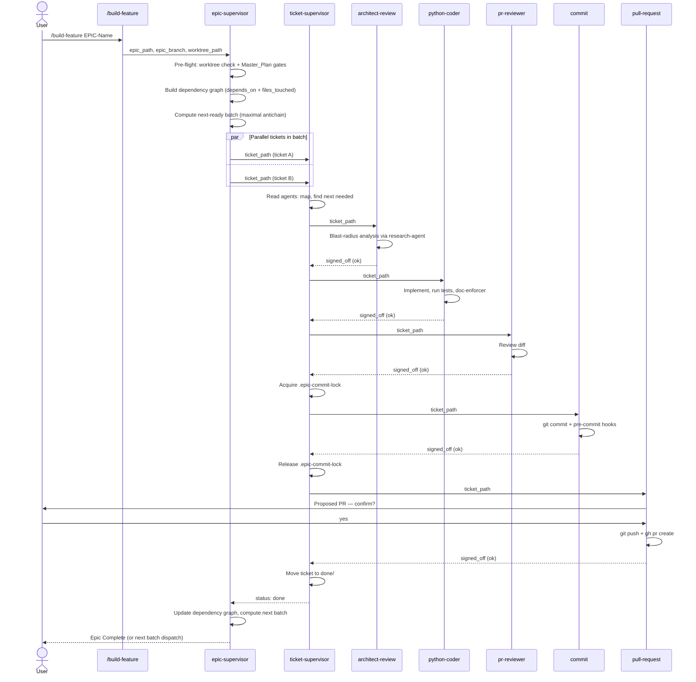
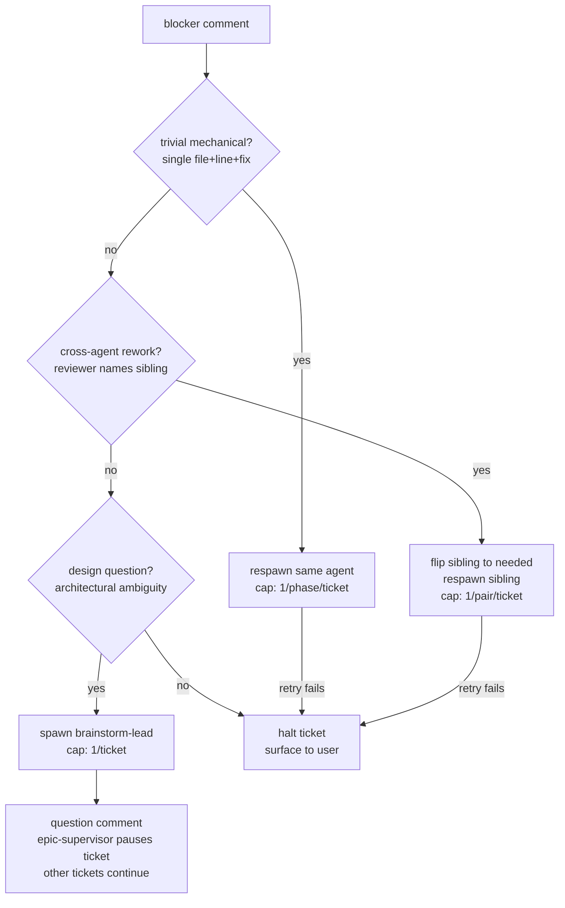

# Agentic Runtime Flow

This document shows how agents invoke each other at runtime when a user
triggers `/build-feature`.

## End-to-End Flow

## Agent Spawn Graph

```mermaid
graph TD
    subgraph Supervisors
        epic_supervisor["Epic Supervisor"]
        ticket_supervisor["Ticket Supervisor"]
        create_ticket["Create Ticket"]
        create_epic["Create Epic"]
        sql_coder["SQL Coder"]
        workflow_architect["Workflow Architect"]
    end
    subgraph Phase Agents
        architect_review["Architect Review"]
        python_coder["Python Coder"]
        test_writer["Test Writer"]
        test_runner["Test Runner"]
        documentation_expert["Documentation Expert"]
        pr_reviewer["PR Reviewer"]
        commit["Commit"]
        pull_request["Pull Request"]
        status_checker["Status Checker"]
        sql_query["SQL Query"]
        adr_author["ADR Author"]
        architecture_diagram_author["Architecture Diagram Author"]
        explanation_author["Explanation Author"]
        how_to_author["How-To Author"]
        reference_author["Reference Author"]
    end
    subgraph Utility Agents
        business_analyst["Business Analyst"]
        brainstorm_lead["Brainstorm Lead"]
        brainstorm_worker["Brainstorm Worker"]
        research_agent["Research Agent"]
        conflict_resolver["Conflict Resolver"]
        worktree_agent["Worktree Agent"]
        changelog_agent["Changelog Agent"]
        retrospective_agent["Retrospective Agent"]
        refinement["Refinement"]
        sql_table_creator["SQL Table Creator"]
        sql_test_writer["SQL Test Writer"]
        sql_procedure_creator["SQL Procedure Creator"]
        sql_function_creator["SQL Function Creator"]
        sql_index_creator["SQL Index Creator"]
        sql_view_creator["SQL View Creator"]
        database_agent["Database Agent"]
        prod_deploy["Prod Deploy"]
        reporting_agent["Reporting Agent"]
        strategy_builder["Strategy Builder"]
        architect_review_deep["Architect Review Deep"]
        architecture_author["Architecture Author"]
        conflict_resolver_deep["Conflict Resolver Deep"]
        onboarding_agent["Onboarding Agent"]
        rollback_agent["Rollback Agent"]
    end
    epic_supervisor --> ticket_supervisor
    epic_supervisor --> retrospective_agent
    epic_supervisor --> worktree_agent
    epic_supervisor --> changelog_agent
    ticket_supervisor --> architect_review
    ticket_supervisor --> python_coder
    ticket_supervisor --> test_writer
    ticket_supervisor --> test_runner
    ticket_supervisor --> documentation_expert
    ticket_supervisor --> pr_reviewer
    ticket_supervisor --> commit
    ticket_supervisor --> pull_request
    ticket_supervisor --> status_checker
    ticket_supervisor --> sql_coder
    ticket_supervisor --> sql_query
    ticket_supervisor --> adr_author
    ticket_supervisor --> architecture_diagram_author
    ticket_supervisor --> explanation_author
    ticket_supervisor --> how_to_author
    ticket_supervisor --> reference_author
    create_ticket --> business_analyst
    create_ticket --> refinement
    create_ticket --> architect_review
    create_ticket --> create_epic
    create_epic --> business_analyst
    create_epic --> create_ticket
    business_analyst --> research_agent
    brainstorm_lead --> brainstorm_worker
    architect_review --> research_agent
    architect_review --> architect_review_deep
    python_coder --> research_agent
    python_coder --> test_runner
    test_writer --> research_agent
    test_writer --> test_runner
    documentation_expert --> research_agent
    documentation_expert --> adr_author
    documentation_expert --> architecture_author
    documentation_expert --> architecture_diagram_author
    documentation_expert --> explanation_author
    documentation_expert --> how_to_author
    documentation_expert --> reference_author
    pull_request --> conflict_resolver
    conflict_resolver --> conflict_resolver_deep
    status_checker --> research_agent
    sql_coder --> sql_table_creator
    sql_coder --> sql_procedure_creator
    sql_coder --> sql_function_creator
    sql_coder --> sql_index_creator
    sql_coder --> sql_view_creator
    sql_coder --> sql_query
    sql_coder --> sql_test_writer
    sql_coder --> research_agent
    sql_coder --> python_coder
    sql_table_creator --> research_agent
    sql_query --> research_agent
    sql_test_writer --> research_agent
    sql_procedure_creator --> research_agent
    sql_function_creator --> research_agent
    sql_index_creator --> research_agent
    sql_view_creator --> research_agent
    strategy_builder --> research_agent
    style epic_supervisor fill:#4a9eff,color:#fff
    style ticket_supervisor fill:#4a9eff,color:#fff
    style create_ticket fill:#4a9eff,color:#fff
    style create_epic fill:#4a9eff,color:#fff
    style business_analyst fill:#888,color:#fff
    style brainstorm_lead fill:#888,color:#fff
    style brainstorm_worker fill:#888,color:#fff
    style research_agent fill:#888,color:#fff
    style architect_review fill:#45b37a,color:#fff
    style python_coder fill:#45b37a,color:#fff
    style test_writer fill:#45b37a,color:#fff
    style test_runner fill:#45b37a,color:#fff
    style documentation_expert fill:#45b37a,color:#fff
    style pr_reviewer fill:#45b37a,color:#fff
    style commit fill:#45b37a,color:#fff
    style pull_request fill:#45b37a,color:#fff
    style conflict_resolver fill:#888,color:#fff
    style status_checker fill:#45b37a,color:#fff
    style worktree_agent fill:#888,color:#fff
    style changelog_agent fill:#888,color:#fff
    style retrospective_agent fill:#888,color:#fff
    style refinement fill:#888,color:#fff
    style sql_coder fill:#4a9eff,color:#fff
    style sql_table_creator fill:#888,color:#fff
    style sql_query fill:#45b37a,color:#fff
    style sql_test_writer fill:#888,color:#fff
    style sql_procedure_creator fill:#888,color:#fff
    style sql_function_creator fill:#888,color:#fff
    style sql_index_creator fill:#888,color:#fff
    style sql_view_creator fill:#888,color:#fff
    style database_agent fill:#888,color:#fff
    style prod_deploy fill:#888,color:#fff
    style reporting_agent fill:#888,color:#fff
    style strategy_builder fill:#888,color:#fff
    style workflow_architect fill:#4a9eff,color:#fff
    style adr_author fill:#45b37a,color:#fff
    style architect_review_deep fill:#888,color:#fff
    style architecture_author fill:#888,color:#fff
    style architecture_diagram_author fill:#45b37a,color:#fff
    style conflict_resolver_deep fill:#888,color:#fff
    style explanation_author fill:#45b37a,color:#fff
    style how_to_author fill:#45b37a,color:#fff
    style onboarding_agent fill:#888,color:#fff
    style reference_author fill:#45b37a,color:#fff
    style rollback_agent fill:#888,color:#fff
    style database_agent stroke-dasharray: 5 5
    style prod_deploy stroke-dasharray: 5 5
    style reporting_agent stroke-dasharray: 5 5
    style strategy_builder stroke-dasharray: 5 5
    style architect_review_deep stroke-dasharray: 5 5
    style architecture_author stroke-dasharray: 5 5
    style architecture_diagram_author stroke-dasharray: 5 5
    style conflict_resolver_deep stroke-dasharray: 5 5
    style onboarding_agent stroke-dasharray: 5 5
    style reference_author stroke-dasharray: 5 5
    style rollback_agent stroke-dasharray: 5 5
```

<!-- BEGIN:AGENT_SPAWN_GRAPH -->
<!-- registry-hash:7d2dc871 -->

<!-- END:AGENT_SPAWN_GRAPH -->

## Failure Adjudication

