# Agent Documentation

This file is the front door for everything agent-related. Read it first; follow the links in [§6 Further Reading](#6-further-reading) for the rules and reference docs.

---

## §1 What is an agent?

Agents are spawned execution units that pin a model tier and a tool allowlist, isolating each task from the parent Opus session's full context. They wrap canonical skills or workflows — or implement standalone behaviour — so that mechanical work runs on Haiku, structured work on Sonnet, and novel synthesis is reserved for Opus reached only via gatekeeper escalation. The key distinction from skills is that **skills cannot pin a model** in their frontmatter — only agents can; the key distinction from slash commands is that slash commands surface workflow bodies directly from `.claude/commands/`, while agents auto-trigger from prose intent matching their `description` field and run on the pinned tier.

---

## §2 Agents vs. Skills vs. Slash Commands

| Surface | What it is |
|---|---|
| **Agent** | Pinned-tier execution unit at `.claude/agents/<agent>.md`; the only surface that can set `model:` and `tools:`. |
| **Skill** | Canonical procedure at `.claude/skills/<name>/SKILL.md`; provider-side, model-agnostic — cannot pin a tier. |
| **Slash command** | User-facing trigger. Each `/<command>` resolves to its workflow file at `.claude/commands/<command>.md` (built from `leafcutter/templates/workflows/`). Auto-trigger from prose routes to the matching agent via its `description` field. See [conventions.md §2](conventions.md#2-file-layout). |

For the three-file layout that pairs these surfaces (agent + command + reference doc), see [conventions.md §2](conventions.md#2-file-layout).

---

## §3 Model Tier Summary

<!-- canonical: ADR-006 §2.1 -->

| Tier | Trigger condition |
|---|---|
| **Haiku** | Mechanical, deterministic procedures with no judgement. Inputs map to outputs by a fixed recipe. |
| **Sonnet** | Standard SWE work bounded by clear patterns. The default tier for nearly every agent. |
| **Opus** | Novel synthesis or escalation. Never the default — only reached via gatekeeper escalation, never picked at the agent's frontmatter level. |

ADR-006 is the canonical source — if this table drifts, [ADR-006 §2.1](../architecture/ADR-006-agent-model-tiers.md#21-three-tier-model-ladder) wins.

---

## §4 Agent Topology (Auto-generated)

The diagrams below are generated from `config/agent_registry.json`. Run
`python leafcutter/scripts/generate_agent_diagram.py --output-format embed`
(or `build.py --update-diagrams`) to refresh them after registry changes.

### Spawn Graph

```mermaid
graph TD
    subgraph Supervisors
        epic_supervisor["Epic Supervisor"]
        ticket_supervisor["Ticket Supervisor"]
        create_ticket["Create Ticket"]
        create_epic["Create Epic"]
        sql_coder["SQL Coder"]
        workflow_architect["Workflow Architect"]
    end
    subgraph Phase Agents
        architect_review["Architect Review"]
        python_coder["Python Coder"]
        test_writer["Test Writer"]
        test_runner["Test Runner"]
        documentation_expert["Documentation Expert"]
        pr_reviewer["PR Reviewer"]
        commit["Commit"]
        pull_request["Pull Request"]
        status_checker["Status Checker"]
        sql_query["SQL Query"]
        adr_author["ADR Author"]
        architecture_diagram_author["Architecture Diagram Author"]
        explanation_author["Explanation Author"]
        how_to_author["How-To Author"]
        reference_author["Reference Author"]
    end
    subgraph Utility Agents
        business_analyst["Business Analyst"]
        brainstorm_lead["Brainstorm Lead"]
        brainstorm_worker["Brainstorm Worker"]
        research_agent["Research Agent"]
        test_planner["Test Planner"]
        conflict_resolver["Conflict Resolver"]
        worktree_agent["Worktree Agent"]
        changelog_agent["Changelog Agent"]
        retrospective_agent["Retrospective Agent"]
        refinement["Refinement"]
        sql_table_creator["SQL Table Creator"]
        sql_test_writer["SQL Test Writer"]
        sql_procedure_creator["SQL Procedure Creator"]
        sql_function_creator["SQL Function Creator"]
        sql_index_creator["SQL Index Creator"]
        sql_view_creator["SQL View Creator"]
        database_agent["Database Agent"]
        prod_deploy["Prod Deploy"]
        reporting_agent["Reporting Agent"]
        strategy_builder["Strategy Builder"]
        architect_review_deep["Architect Review Deep"]
        architecture_author["Architecture Author"]
        conflict_resolver_deep["Conflict Resolver Deep"]
        onboarding_agent["Onboarding Agent"]
        rollback_agent["Rollback Agent"]
    end
    epic_supervisor --> ticket_supervisor
    epic_supervisor --> retrospective_agent
    epic_supervisor --> worktree_agent
    epic_supervisor --> changelog_agent
    ticket_supervisor --> architect_review
    ticket_supervisor --> python_coder
    ticket_supervisor --> test_writer
    ticket_supervisor --> test_runner
    ticket_supervisor --> documentation_expert
    ticket_supervisor --> pr_reviewer
    ticket_supervisor --> commit
    ticket_supervisor --> pull_request
    ticket_supervisor --> status_checker
    ticket_supervisor --> sql_coder
    ticket_supervisor --> sql_query
    ticket_supervisor --> adr_author
    ticket_supervisor --> architecture_diagram_author
    ticket_supervisor --> explanation_author
    ticket_supervisor --> how_to_author
    ticket_supervisor --> reference_author
    create_ticket --> business_analyst
    create_ticket --> refinement
    create_ticket --> architect_review
    create_ticket --> create_epic
    create_epic --> business_analyst
    create_epic --> create_ticket
    business_analyst --> research_agent
    business_analyst --> test_planner
    brainstorm_lead --> brainstorm_worker
    architect_review --> research_agent
    architect_review --> architect_review_deep
    python_coder --> research_agent
    python_coder --> test_runner
    test_planner --> research_agent
    test_writer --> research_agent
    test_writer --> test_runner
    documentation_expert --> research_agent
    documentation_expert --> adr_author
    documentation_expert --> architecture_author
    documentation_expert --> architecture_diagram_author
    documentation_expert --> explanation_author
    documentation_expert --> how_to_author
    documentation_expert --> reference_author
    pull_request --> conflict_resolver
    conflict_resolver --> conflict_resolver_deep
    status_checker --> research_agent
    sql_coder --> sql_table_creator
    sql_coder --> sql_procedure_creator
    sql_coder --> sql_function_creator
    sql_coder --> sql_index_creator
    sql_coder --> sql_view_creator
    sql_coder --> sql_query
    sql_coder --> sql_test_writer
    sql_coder --> research_agent
    sql_coder --> python_coder
    sql_table_creator --> research_agent
    sql_query --> research_agent
    sql_test_writer --> research_agent
    sql_procedure_creator --> research_agent
    sql_function_creator --> research_agent
    sql_index_creator --> research_agent
    sql_view_creator --> research_agent
    strategy_builder --> research_agent
    style epic_supervisor fill:#4a9eff,color:#fff
    style ticket_supervisor fill:#4a9eff,color:#fff
    style create_ticket fill:#4a9eff,color:#fff
    style create_epic fill:#4a9eff,color:#fff
    style business_analyst fill:#888,color:#fff
    style brainstorm_lead fill:#888,color:#fff
    style brainstorm_worker fill:#888,color:#fff
    style research_agent fill:#888,color:#fff
    style architect_review fill:#45b37a,color:#fff
    style python_coder fill:#45b37a,color:#fff
    style test_planner fill:#888,color:#fff
    style test_writer fill:#45b37a,color:#fff
    style test_runner fill:#45b37a,color:#fff
    style documentation_expert fill:#45b37a,color:#fff
    style pr_reviewer fill:#45b37a,color:#fff
    style commit fill:#45b37a,color:#fff
    style pull_request fill:#45b37a,color:#fff
    style conflict_resolver fill:#888,color:#fff
    style status_checker fill:#45b37a,color:#fff
    style worktree_agent fill:#888,color:#fff
    style changelog_agent fill:#888,color:#fff
    style retrospective_agent fill:#888,color:#fff
    style refinement fill:#888,color:#fff
    style sql_coder fill:#4a9eff,color:#fff
    style sql_table_creator fill:#888,color:#fff
    style sql_query fill:#45b37a,color:#fff
    style sql_test_writer fill:#888,color:#fff
    style sql_procedure_creator fill:#888,color:#fff
    style sql_function_creator fill:#888,color:#fff
    style sql_index_creator fill:#888,color:#fff
    style sql_view_creator fill:#888,color:#fff
    style database_agent fill:#888,color:#fff
    style prod_deploy fill:#888,color:#fff
    style reporting_agent fill:#888,color:#fff
    style strategy_builder fill:#888,color:#fff
    style workflow_architect fill:#4a9eff,color:#fff
    style adr_author fill:#45b37a,color:#fff
    style architect_review_deep fill:#888,color:#fff
    style architecture_author fill:#888,color:#fff
    style architecture_diagram_author fill:#45b37a,color:#fff
    style conflict_resolver_deep fill:#888,color:#fff
    style explanation_author fill:#45b37a,color:#fff
    style how_to_author fill:#45b37a,color:#fff
    style onboarding_agent fill:#888,color:#fff
    style reference_author fill:#45b37a,color:#fff
    style rollback_agent fill:#888,color:#fff
    style database_agent stroke-dasharray: 5 5
    style prod_deploy stroke-dasharray: 5 5
    style reporting_agent stroke-dasharray: 5 5
    style strategy_builder stroke-dasharray: 5 5
    style architect_review_deep stroke-dasharray: 5 5
    style architecture_author stroke-dasharray: 5 5
    style architecture_diagram_author stroke-dasharray: 5 5
    style conflict_resolver_deep stroke-dasharray: 5 5
    style onboarding_agent stroke-dasharray: 5 5
    style reference_author stroke-dasharray: 5 5
    style rollback_agent stroke-dasharray: 5 5
```

<!-- BEGIN:AGENT_SPAWN_GRAPH -->
<!-- registry-hash:7d2dc871 -->

<!-- END:AGENT_SPAWN_GRAPH -->

### Skill Map

```mermaid
graph LR
    subgraph Agents
        a_epic_supervisor["epic-supervisor"]
        a_ticket_supervisor["ticket-supervisor"]
        a_create_ticket["create-ticket"]
        a_create_epic["create-epic"]
        a_architect_review["architect-review"]
        a_python_coder["python-coder"]
        a_test_writer["test-writer"]
        a_test_runner["test-runner"]
        a_documentation_expert["documentation-expert"]
        a_pr_reviewer["pr-reviewer"]
        a_commit["commit"]
        a_pull_request["pull-request"]
        a_status_checker["status-checker"]
        a_sql_coder["sql-coder"]
        a_sql_query["sql-query"]
        a_sql_test_writer["sql-test-writer"]
        a_database_agent["database-agent"]
        a_prod_deploy["prod-deploy"]
        a_reporting_agent["reporting-agent"]
        a_strategy_builder["strategy-builder"]
        a_workflow_architect["workflow-architect"]
        a_architecture_diagram_author["architecture-diagram-author"]
    end
    subgraph Skills
        s_add_agent_to_package{{'add-agent-to-package'}}
        s_add_skill_to_package{{'add-skill-to-package'}}
        s_building_epics{{'building-epics'}}
        s_create_hook{{'create-hook'}}
        s_db{{'db'}}
        s_fetch_prod_logs{{'fetch-prod-logs'}}
        s_find_context_candle{{'find-context-candle'}}
        s_package_audit{{'package-audit'}}
        s_signoff{{'signoff'}}
        s_sql_query_past_queries{{'sql-query-past-queries'}}
        s_ticket_authoring{{'ticket-authoring'}}
        s_write_c4_diagram{{'write-c4-diagram'}}
    end
    a_epic_supervisor --> s_building_epics
    a_epic_supervisor --> s_signoff
    a_ticket_supervisor --> s_building_epics
    a_ticket_supervisor --> s_signoff
    a_create_ticket --> s_ticket_authoring
    a_create_epic --> s_ticket_authoring
    a_architect_review --> s_signoff
    a_python_coder --> s_signoff
    a_test_writer --> s_signoff
    a_test_runner --> s_signoff
    a_documentation_expert --> s_signoff
    a_pr_reviewer --> s_signoff
    a_commit --> s_signoff
    a_pull_request --> s_signoff
    a_status_checker --> s_signoff
    a_sql_coder --> s_signoff
    a_sql_query --> s_signoff
    a_sql_query --> s_sql_query_past_queries
    a_sql_test_writer --> s_signoff
    a_database_agent --> s_db
    a_prod_deploy --> s_fetch_prod_logs
    a_reporting_agent --> s_db
    a_reporting_agent --> s_fetch_prod_logs
    a_strategy_builder --> s_db
    a_strategy_builder --> s_find_context_candle
    a_workflow_architect --> s_create_hook
    a_workflow_architect --> s_add_agent_to_package
    a_workflow_architect --> s_add_skill_to_package
    a_workflow_architect --> s_package_audit
    a_architecture_diagram_author --> s_write_c4_diagram
```

<!-- BEGIN:AGENT_SKILL_MAP -->
<!-- registry-hash:7d2dc871 -->

<!-- END:AGENT_SKILL_MAP -->

### Full Topology

```mermaid
graph TD
    %% Combined spawn graph + skill map
    %% Spawn graph nodes and edges (abbreviated for clarity)
    epic_supervisor["epic-supervisor"]
    epic_supervisor --> ticket_supervisor
    epic_supervisor --> retrospective_agent
    epic_supervisor --> worktree_agent
    epic_supervisor --> changelog_agent
    ticket_supervisor["ticket-supervisor"]
    ticket_supervisor --> architect_review
    ticket_supervisor --> python_coder
    ticket_supervisor --> test_writer
    %% ... and 13 more phase agents
    create_ticket["create-ticket"]
    create_ticket --> business_analyst
    create_ticket --> refinement
    create_ticket --> architect_review
    create_ticket --> create_epic
    create_epic["create-epic"]
    create_epic --> business_analyst
    create_epic --> create_ticket
    business_analyst["business-analyst"]
    business_analyst --> research_agent
    business_analyst --> test_planner
    brainstorm_lead["brainstorm-lead"]
    brainstorm_lead --> brainstorm_worker
    brainstorm_worker["brainstorm-worker"]
    research_agent["research-agent"]
    architect_review["architect-review"]
    architect_review --> research_agent
    architect_review --> architect_review_deep
    python_coder["python-coder"]
    python_coder --> research_agent
    python_coder --> test_runner
    test_planner["test-planner"]
    test_planner --> research_agent
    test_writer["test-writer"]
    test_writer --> research_agent
    test_writer --> test_runner
    test_runner["test-runner"]
    documentation_expert["documentation-expert"]
    documentation_expert --> research_agent
    documentation_expert --> adr_author
    documentation_expert --> architecture_author
    documentation_expert --> architecture_diagram_author
    documentation_expert --> explanation_author
    documentation_expert --> how_to_author
    documentation_expert --> reference_author
    pr_reviewer["pr-reviewer"]
    commit["commit"]
    pull_request["pull-request"]
    pull_request --> conflict_resolver
    conflict_resolver["conflict-resolver"]
    conflict_resolver --> conflict_resolver_deep
    status_checker["status-checker"]
    status_checker --> research_agent
    worktree_agent["worktree-agent"]
    changelog_agent["changelog-agent"]
    retrospective_agent["retrospective-agent"]
    refinement["refinement"]
    sql_coder["sql-coder"]
    sql_coder --> sql_table_creator
    sql_coder --> sql_procedure_creator
    sql_coder --> sql_function_creator
    sql_coder --> sql_index_creator
    sql_coder --> sql_view_creator
    sql_coder --> sql_query
    sql_coder --> sql_test_writer
    sql_coder --> research_agent
    sql_coder --> python_coder
    sql_table_creator["sql-table-creator"]
    sql_table_creator --> research_agent
    sql_query["sql-query"]
    sql_query --> research_agent
    sql_test_writer["sql-test-writer"]
    sql_test_writer --> research_agent
    sql_procedure_creator["sql-procedure-creator"]
    sql_procedure_creator --> research_agent
    sql_function_creator["sql-function-creator"]
    sql_function_creator --> research_agent
    sql_index_creator["sql-index-creator"]
    sql_index_creator --> research_agent
    sql_view_creator["sql-view-creator"]
    sql_view_creator --> research_agent
    database_agent["database-agent"]
    prod_deploy["prod-deploy"]
    reporting_agent["reporting-agent"]
    strategy_builder["strategy-builder"]
    strategy_builder --> research_agent
    workflow_architect["workflow-architect"]
    adr_author["adr-author"]
    architect_review_deep["architect-review-deep"]
    architecture_author["architecture-author"]
    architecture_diagram_author["architecture-diagram-author"]
    conflict_resolver_deep["conflict-resolver-deep"]
    explanation_author["explanation-author"]
    how_to_author["how-to-author"]
    onboarding_agent["onboarding-agent"]
    reference_author["reference-author"]
    rollback_agent["rollback-agent"]
```

<!-- BEGIN:AGENT_TOPOLOGY -->
<!-- registry-hash:7d2dc871 -->

<!-- END:AGENT_TOPOLOGY -->

### PROJECT_CONTEXT Injection — Runtime-Discovery Convention

Each portable agent may have a per-project companion at
`.agents/agents/<name>/PROJECT_CONTEXT.md`. This file is **read at agent startup
(runtime discovery)** — it is NOT inlined into the compiled agent body by `build.py`.

```
.agents/agents/sql-coder/PROJECT_CONTEXT.md       ← read at startup
.agents/agents/sql-query/PROJECT_CONTEXT.md       ← read at startup
.agents/agents/sql-test-writer/PROJECT_CONTEXT.md ← read at startup
.agents/agents/sql-table-creator/PROJECT_CONTEXT.md ← read at startup
.agents/agents/sql-index-creator/PROJECT_CONTEXT.md ← read at startup
.agents/agents/sql-procedure-creator/PROJECT_CONTEXT.md ← read at startup
.agents/agents/sql-function-creator/PROJECT_CONTEXT.md ← read at startup
.agents/agents/sql-view-creator/PROJECT_CONTEXT.md ← read at startup
```

Edge semantics:
- **agent → PROJECT_CONTEXT.md**: "runtime read at startup" (discovery edge)
- **build.py → PROJECT_CONTEXT.md**: "presence check only" (probe edge; content is NOT inlined)

If `PROJECT_CONTEXT.md` is absent for an agent, the agent logs one debug line and
continues with template-only behaviour:
```
PROJECT_CONTEXT.md not found for <agent-name>; running template-only
```

**Reference**: [ADR-025 — Portable Agent PROJECT_CONTEXT Layout](../architecture/adrs/ADR-025-portable-agent-project-context-layout.md)

## §5 Agent Inventory

> **Update this file when adding an agent.** Adding or renaming an agent under `.claude/agents/` is incomplete until this inventory is updated in the same PR. If [EPIC-CodingAgents] or [EPIC-SkillRunnerAgents] drops a planned agent, the README must update at the same time.

Agents are grouped by family and sorted alphabetically within each group. Each entry links to its reference doc when one exists.

### `analytics/` family

| Name | Tier | Visibility | Slash command(s) | Notes |
|---|---|---|---|---|
| [reporting-agent](analytics/trade-report.md) | Sonnet | User-facing | `/trade-report` (additional commands planned) | Existing today — Multi-Skill Dispatcher; first occupant of the `analytics/` family. |
| `pipeline-health-runner` | Sonnet | User-facing | `/pipeline-health` | (planned) — [EPIC-SkillRunnerAgents] |
| `project-report-runner` | Sonnet | User-facing | `/project-report` | (planned) — [EPIC-SkillRunnerAgents] |
| `schema-check-runner` | Sonnet | User-facing | `/schema-check` | (planned) — [EPIC-SkillRunnerAgents] |
| `strategy-analytics-runner` | Sonnet | User-facing | `/strategy-analytics` | (planned) — [EPIC-SkillRunnerAgents] |
| `strategy-check-runner` | Sonnet | User-facing | `/strategy-check` | (planned) — [EPIC-SkillRunnerAgents] |
| `find-context-candle-runner` | Sonnet | User-facing | `/find-context-candle` | (planned) — [EPIC-SkillRunnerAgents] |
| `trade-analysis-runner` | Sonnet | User-facing | `/trade-analysis` | (planned) — [EPIC-SkillRunnerAgents] |

### `coding/` family

| Name | Tier | Visibility | Slash command(s) | Notes |
|---|---|---|---|---|
| [adr-author](coding/adr-author.md) | Sonnet | Internal | — | Dispatched by `documentation-expert`; produces correctly-numbered ADRs in `docs/architecture/`. [EPIC-CodingAgents ticket 22] |
| [architect-review](coding/architect-review.md) | Sonnet | Internal | — | Sonnet → Opus gatekeeper; escalates structural-impact reviews to `architect-review-deep` (Opus). [EPIC-CodingAgents ticket 03] |
| `architect-review-deep` | Opus | Internal | — | Spawned by `architect-review` for structural-impact reviews. [EPIC-CodingAgents ticket 03] |
| [architecture-author](coding/architecture-author.md) | Sonnet | Internal | — | Dispatched by `documentation-expert`; non-ADR architecture docs (system designs, data flow, diagrams). [EPIC-CodingAgents ticket 23] |
| [architecture-diagram-author](coding/architecture-diagram-author.md) | Sonnet | Internal | — | C4 mermaid diagram specialist; always loads `write-c4-diagram` skill; validates tier and produces frontmatter + skeleton + legend in one pass. [EPIC-ArchitectureDocs ticket 26] |
| [business-analyst](coding/business-analyst.md) | Sonnet | Internal | — | Clarifies business intent / value / success criteria; first stage in ticket-creation pipeline. [EPIC-CodingAgents ticket 01] |
| [brainstorm-lead](coding/brainstorm-lead.md) | Opus | Internal | — | Spawned by `ticket-supervisor` per `building-epics` §3.3 (open-ended design choice). Spawns 2-3 `brainstorm-worker`s in parallel and synthesises a single recommendation (consensus or present-all). Cap: 1 invocation per ticket. [EPIC-AgentSupervisor ticket 09] |
| [brainstorm-worker](coding/brainstorm-lead.md#5-brainstorm-worker-constraints-single-perspective-analyst) | Sonnet | Internal | — | Single-perspective analyst spawned only by `brainstorm-lead`. Receives a question + perspective lens; returns a strict `{perspective, recommendation, rationale, risks}` block. Does NOT spawn sub-agents. [EPIC-AgentSupervisor ticket 09] |
| [commit](coding/commit.md) | Sonnet | Confirmation-gated | `/commit` | Confirmation-gated commit; auto-fixes pre-commit hook failures via `precommit-autofix` (Haiku/Sonnet routing); single retry. [EPIC-CodingAgents ticket 09] |
| [conflict-resolver](coding/conflict-resolver.md) | Sonnet | Internal | — | Sonnet → Opus gatekeeper; spawned by `pull-request` on merge conflicts. Escalates structural conflicts to `conflict-resolver-deep` (Opus). [EPIC-CodingAgents ticket 11] |
| `conflict-resolver-deep` | Opus | Internal | — | Spawned by `conflict-resolver` for structural merge conflicts. [EPIC-CodingAgents ticket 11] |
| [create-epic](coding/create-epic.md) | Haiku | Internal | — | Scaffolds folder + Master_Plan + N stub tickets; fans out N parallel `create-ticket` calls. Invoked by `create-ticket` when deliverables_count > 3. [EPIC-CodingAgents ticket 04] |
| [create-ticket](coding/create-ticket.md) | Sonnet | User-facing | `/create-ticket` | Single user entry for ticket creation — orchestrates BA → refinement + architect-review or create-epic. [EPIC-CodingAgents ticket 05] |
| [database-agent](coding/database-agent.md) | Sonnet | Confirmation-gated | `/database` | Apply migrations, reload SQL, schema-check, worker ops, prod-sql-deploy. [EPIC-CodingAgents ticket 13] |
| [documentation-expert](coding/documentation-expert.md) | Sonnet | User-facing | `/documentation` | Diataxis-routing orchestrator — classifies intent, dispatches to specialists (tickets 21-25). [EPIC-CodingAgents ticket 20] |
| [epic-supervisor](coding/epic-supervisor.md) | Sonnet | User-facing | `/build-feature`; internal hook `/epic-supervisor` | Drives a whole epic ticket-by-ticket via `depends_on` + `files_touched` graph; dispatches `ticket-supervisor`s in parallel batches; halts only on structural blockers. [EPIC-AgentSupervisor ticket 08] |
| [explanation-author](coding/explanation-author.md) | Sonnet | Internal | — | Dispatched by `documentation-expert`; understanding-oriented "why" docs in `docs/explanation/` or topical folders. [EPIC-CodingAgents ticket 25] |
| [how-to-author](coding/how-to-author.md) | Sonnet | Internal | — | Dispatched by `documentation-expert`; task-oriented step-by-step guides under `docs/how-to/`. [EPIC-CodingAgents ticket 21] |
| [pr-reviewer](coding/pr-reviewer.md) | Sonnet | User-facing | `/pr-review` | Sonnet → Opus gatekeeper; pre-PR self-review wrapping `pr-review-toolkit:review-pr`; high/medium/low classification, escalates medium cluster (>3) to Opus. [EPIC-CodingAgents ticket 28] |
| [prod-deploy](coding/prod-deploy.md) | Sonnet | Confirmation-gated | `/prod-deploy` | Sonnet → Opus gatekeeper; full prod-deploy choreography (SQL + Alembic + worker restarts + smoke). Requires verbatim "yes deploy to prod". [EPIC-CodingAgents ticket 27] |
| [pull-request](coding/pull-request.md) | Sonnet | Confirmation-gated | `/pull-request` | Drafts PR title+body, confirms, pushes, runs `gh pr create`; spawns `conflict-resolver` on merge conflicts. [EPIC-CodingAgents ticket 12] |
| [python-coder](coding/python-coder.md) | Sonnet | User-facing | `/python-coder` | Standards-enforcing Python implementation; pulls conventions, runs `doc-enforcer` + `complexity-reduction`. [EPIC-CodingAgents ticket 06] |
| [reference-author](coding/reference-author.md) | Sonnet | Internal | — | Dispatched by `documentation-expert`; lookup-oriented reference docs (API, schema, glossary). [EPIC-CodingAgents ticket 24] |
| [refinement](coding/refinement.md) | Sonnet | Internal | — | Five-lens technical clarifying-question pass; delegates codebase questions to `research-agent`. [EPIC-CodingAgents ticket 02] |
| [research-agent](coding/research-agent.md) | Sonnet | Internal | — | Central context-gathering hub; owns all cross-cutting search (Grep/Glob + jcodemunch/serena/context7); exempt from strict-research-delegation rule. [EPIC-CodingAgents ticket 00] |
| [sql-coder](coding/sql-coder.md) | Sonnet | User-facing | `/sql-coder` | Orchestrator; dispatches SQL specialist sub-agents (table/index/procedure/function/view/query/test-writer) by artifact; owns local-deploy + `sql-test` gate. Portable — reads `.agents/agents/sql-coder/PROJECT_CONTEXT.md` at startup. [EPIC-PortableSQLAgents ticket 03] |
| [sql-function-creator](coding/sql-function-creator.md) | Sonnet | Internal | — | Dispatched by `sql-coder`; SQL functions (volatility-aware, language-aware). [EPIC-CodingAgents ticket 18] |
| [sql-index-creator](coding/sql-index-creator.md) | Sonnet | Internal | — | Dispatched by `sql-coder`; file-based indexes under `sql_functions/schema/indexes/` (NOT Alembic). [EPIC-CodingAgents ticket 16] |
| [sql-procedure-creator](coding/sql-procedure-creator.md) | Sonnet | Internal | — | Dispatched by `sql-coder`; stored procedures under `sql_functions/procedures/` plus matching test files. [EPIC-CodingAgents ticket 17] |
| [sql-table-creator](coding/sql-table-creator.md) | Sonnet | Internal | — | Dispatched by `sql-coder`; SQLAlchemy model + Alembic migration + `models/__init__.py` + components.json + schema SQL. [EPIC-CodingAgents ticket 15] |
| [sql-view-creator](coding/sql-view-creator.md) | Sonnet | Internal | — | Dispatched by `sql-coder`; regular views, materialized views, TimescaleDB CAGs; flavour-decision rubric. Portable. [EPIC-PortableSQLAgents ticket 04] |
| [sql-query](coding/sql-query.md) | Sonnet | User-facing | `/sql-query` | Ad-hoc SELECT query authoring; invokes `sql-query-past-queries` skill to surface reusable prior queries; never executes autonomously. Portable. [EPIC-PortableSQLAgents ticket 05] |
| [sql-test-writer](coding/sql-test-writer.md) | Sonnet | Internal | — | Dispatched by `sql-coder`; authors SQL test files using transaction-rollback isolation (`unittest.TestCase`); reads PROJECT_CONTEXT for test_folder, framework, slow_test_marker. Portable. [EPIC-PortableSQLAgents ticket 06] |
| [status-checker](coding/status-checker.md) | Sonnet | User-facing | `/status` | Investigates ticket state via git + prod-puller; closes confirmed-done tickets on explicit user request. [EPIC-CodingAgents ticket 08] |
| [test-planner](coding/test-planner.md) | Sonnet | Internal | — | Spawned by `business-analyst` during ticket creation; reads `testing_context` config; returns a `test_requirements` JSON block specifying which tests to write, their type, target directory, and what they cover. Never writes code. [EPIC-PortableDevWorkflow ticket 36] |
| [test-runner](coding/test-runner.md) | Sonnet | User-facing | `/test` | Picks right suite from diff; structured failure report; auto-trigger for `python-coder`/`sql-coder` inner loops. Now runs after `test-writer` in the phase sequence. [EPIC-CodingAgents ticket 26] |
| [test-writer](coding/test-writer.md) | Sonnet | Internal | — | Phase agent dispatched by `ticket-supervisor` when a ticket has a non-empty `test_requirements.tests` array; writes test files per the `test-planner` spec using the correct framework and setUp/tearDown pattern; runs after `python-coder`, before `test-runner`. [EPIC-PortableDevWorkflow ticket 36] |
| [ticket-supervisor](coding/ticket-supervisor.md) | Sonnet | Internal | — | Drives a single ticket through its phase agents (read `agents:` map → spawn next `needed` → parse comment → route ok/handoff/blocker/question); runs failure-adjudication ladder; holds the commit-phase lock. Invoked only by `epic-supervisor`. [EPIC-AgentSupervisor ticket 08] |
| [worktree-agent](coding/worktree-agent.md) | Haiku | Confirmation-gated | `/worktree` | Wraps `feature` skill (create, non-destructive) and `close-worktree` workflow (remove, confirmation-gated). [EPIC-CodingAgents ticket 14] |

### `ops/` family

| Name | Tier | Visibility | Slash command(s) | Notes |
|---|---|---|---|---|
| `docker-cleanup-runner` | Haiku | User-facing | `/docker-cleanup` | (planned) — [EPIC-SkillRunnerAgents] |
| `fetch-prod-logs-runner` | Haiku | User-facing | `/fetch-prod-logs` | (planned) — [EPIC-SkillRunnerAgents] |
| `prod-puller-runner` | Haiku | User-facing | `/prod-puller` | (planned) — [EPIC-SkillRunnerAgents] |
| `sql-test-runner` | Haiku | User-facing | `/sql-test` | (planned) — [EPIC-SkillRunnerAgents] |

---

## §6 Further Reading

| Document | Purpose |
|---|---|
| [docs/agents/conventions.md](conventions.md) | Authoring rules — frontmatter schema, file layout, visibility classes, tool allowlists, patterns. Read this before writing a new agent. |
| [docs/architecture/adrs/ADR-006-agent-model-tiers.md](../architecture/ADR-006-agent-model-tiers.md) | Canonical policy source — three-tier model ladder (§2.1), Skill Wrapper pattern (§2.2), Gatekeeper Escalation pattern (§2.3), Multi-Skill Dispatcher pattern (§2.4), visibility classes (§2.5), tool allowlist (§2.6), nesting depth (§2.7), clarifications (§2.8). |
| [docs/architecture/agent_delivery_workflows.md](../architecture/agent_delivery_workflows.md) | Visual architecture mapping of user-facing slash commands to sub-agents, and flowchart of the Supervisor Distribution and Adjudication flows. |
| [docs/agents/analytics/trade-report.md](analytics/trade-report.md) | Reference doc for `reporting-agent` — the first occupant of the `analytics/` family and the canonical Skill Wrapper example. |
| [.claude/agents/reporting-agent.md](../../.claude/agents/reporting-agent.md) | The agent file itself — frontmatter + system prompt for `reporting-agent`. |

[EPIC-CodingAgents]: ../../tickets/09_done/EPIC-CodingAgents/Master_Plan.md
[EPIC-SkillRunnerAgents]: ../../tickets/00_inbox/epics/EPIC-SkillRunnerAgents/Master_Plan.md
[EPIC-AgentSupervisor]: ../../tickets/09_done/EPIC-AgentSupervisor/Master_Plan.md
