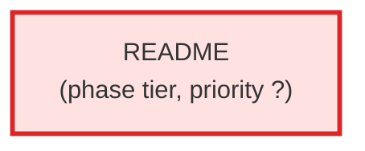

# README

| Field | Value |
|-------|-------|
| Model | — |
| Tier | — |
| Priority | — |
| Portable | No |
| Sign-off capable | No |

---

## When to Use
---

## Knowledge Flow

*No knowledge channels declared.*

---

## Spawn and Dependency

---

## Input / Output Contract

*No structured I/O contract declared.*
---

## Tools Available

*No tools declared.*
---

## Skills Used

*No skills declared.*
---

## Configuration

*No configuration keys declared.*
---

## Contributor Notes

No conditional behaviors — this agent follows a single fixed execution path
