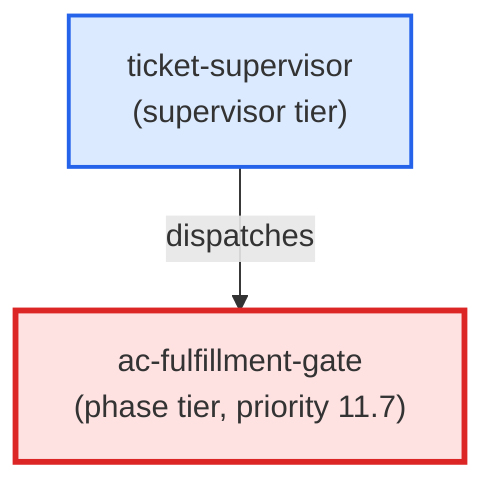

# ac-fulfillment-gate

**AC fulfillment gate. Runs at priority 11.7 (after ac-validator at 11.5, before commit at 12). Verifies AC YAML store fields (work_status, implemented_by, covered_by) are accurate and up-to-date before any commit is made. When verification fails but diff evidence exists, auto-fixes the YAML store fields (append-only, idempotent). Returns status: ok if all ACs pass or ac_traceability is absent; status: blocker with per-AC details if any AC fails after auto-fix attempt. Use when: ticket-supervisor dispatches at priority 11.7 for any ticket that has ac_traceability frontmatter referencing L2/L3 AC YAML files. Skips silently for L0/L1 ACs (composite — fulfillment derived from children).**

| Field | Value |
|-------|-------|
| Model | sonnet |
| Tier | phase |
| Priority | 11.7 |
| Portable | Yes |
| Sign-off capable | Yes |

---

## When to Use

### Spawned By

- `ticket-supervisor`
---

## Knowledge Flow

*No knowledge channels declared.*

---

## Spawn and Dependency

---

## Input / Output Contract

*No structured I/O contract declared.*
---

## Tools Available

| Tool |
|------|
| `Bash` |
| `Read` |
| `Edit` |
---

## Skills Used

| Skill | Mode | Condition |
|-------|------|-----------|
| `signoff` | — | — |
---

## Configuration

*No configuration keys declared.*
---

## Contributor Notes

No conditional behaviors — this agent follows a single fixed execution path
