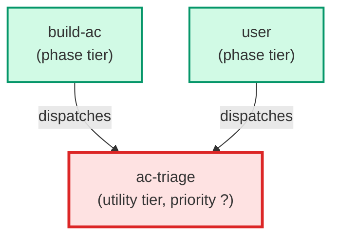

# ac-triage

**Fast triage agent for /plan-feature workflow. Reads the AC store for the
relevant component, compares the user's natural-language request against
existing L0/L1 criteria text, and classifies the routing path as one of:
strategic (new capability, no matching L1 parent), behavioral (adds to
existing feature with a matching L1), technical (adds constraints to existing
ACs), or covered (request fully covered by existing ACs). Returns a
structured JSON decision immediately — no files are written by this agent.
Model-pinned to Haiku tier for speed; must complete triage in < 3s for a
store of 200 ACs.
Use when: /plan-feature workflow Stage 0; before any authoring agent is invoked.**

| Field | Value |
|-------|-------|
| Model | haiku |
| Tier | utility |
| Priority | — |
| Portable | Yes |
| Sign-off capable | No |

---

## When to Use

### Spawned By

- `build-ac`
- `user`
---

## Knowledge Flow

| Channel | Source | Injection Mode | Description |
|---------|--------|----------------|-------------|
| 1 | template description field | — | — |
| 6 | AC YAML files read from docs/acceptance-criteria/ | — | — |
| 7 | bash command output (ls docs/acceptance-criteria/) | — | — |
---

## Spawn and Dependency

---

## Input / Output Contract

### Inputs

| Name | Type | Description |
|------|------|-------------|
| `user_request` | string | Natural-language description of the feature or constraint the user wants to add |
| `component` | string | Optional component name to scope the AC store read to a single subdirectory |

### Outputs

| Name | Type | Description |
|------|------|-------------|
| `routing_decision` | structured_response | JSON object with fields: route, existing_acs, parent_l1_id, rationale |
---

## Tools Available

| Tool |
|------|
| `Read` |
| `Bash` |
---

## Skills Used

*No skills declared.*
---

## Configuration

*No configuration keys declared.*
---

## Contributor Notes

### Key Behavioral Patterns

| Pattern | Trigger | Behavior | Related Agent |
|---------|---------|----------|---------------|
| Covered Fast-Exit | One or more active ACs already fully cover the user_request semantically | Returns route: covered immediately with the matching AC IDs in existing_acs; no further analysis needed | `None` |
| Store-Absent Fallback | docs/acceptance-criteria/ directory does not exist | Returns route: strategic with rationale 'AC store not found — treating as new capability.' without reading any file | `None` |
| Large-Store Scope Guard | AC store contains more than 200 files and a component was supplied | Reads only the component-scoped subdirectory to stay within the < 3s latency budget | `None` |
