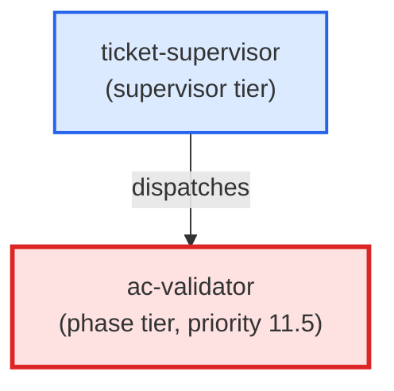

# ac-validator

**Final AC coverage gate. Validates all acceptance criteria are actually covered by the implementation before allowing commit. Reads the ticket ACs, the working diff, and test output, then produces a coverage verdict (ok / blocker / question).
Use when: ticket-supervisor dispatches this agent at priority 11 (after pr-reviewer, before commit) to verify that every AC listed in the ticket has concrete evidence of both implementation and test coverage before the commit phase locks the worktree.**

| Field | Value |
|-------|-------|
| Model | sonnet |
| Tier | phase |
| Priority | 11.5 |
| Portable | Yes |
| Sign-off capable | Yes |

---

## When to Use

### Spawned By

- `ticket-supervisor`
---

## Knowledge Flow

| Channel | Source | Injection Mode | Description |
|---------|--------|----------------|-------------|
| 1 | template description field | — | — |
| 3 | ticket_path from ticket-supervisor | — | — |
| 6 | project files read during execution | — | — |
| 7 | bash command output (git, build, tests) | — | — |
---

## Spawn and Dependency

---

## Input / Output Contract

### Inputs

| Name | Type | Description |
|------|------|-------------|
| `ticket_path` | file_path | Absolute path to the ticket markdown file |

### Outputs

| Name | Type | Description |
|------|------|-------------|
| `sign_off_comment` | sign_off_comment | Sign-off comment with status: ok | blocker | handoff |

### Mutates (Side Effects)

| Name | Type | Description |
|------|------|-------------|
| `ticket_frontmatter_agents_status` | — | Sets agents.ac-validator to signed_off or failed |
| `sign_offs_checklist` | — | Checks the ac-validator checkbox with timestamp |
---

## Tools Available

| Tool |
|------|
| `Bash` |
| `Read` |
| `Edit` |
---

## Skills Used

| Skill | Mode | Condition |
|-------|------|-----------|
| `signoff` | always | — |
---

## Configuration

*No configuration keys declared.*
---

## Contributor Notes

### Key Behavioral Patterns

| Pattern | Trigger | Behavior | Related Agent |
|---------|---------|----------|---------------|
| Conditional Behavior | the section is absent or the list is empty | emit `(status: question)`: | `None` |
| Conditional Behavior | exit code is non-zero | record each ERROR line as a **store-alignment failure** | `None` |
