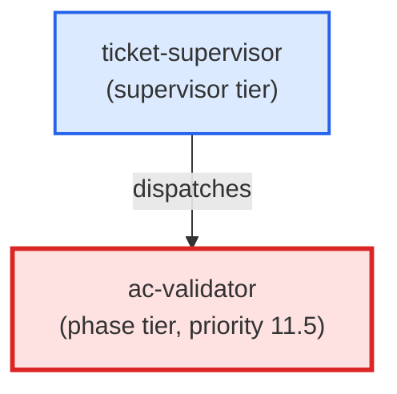

# ac-validator

**Final AC coverage gate. Validates all acceptance criteria are actually covered by the implementation before allowing commit. Reads the ticket ACs, the working diff, and test output, then produces a coverage verdict (ok / blocker / question).
Use when: ticket-supervisor dispatches this agent at priority 11 (after pr-reviewer, before commit) to verify that every AC listed in the ticket has concrete evidence of both implementation and test coverage before the commit phase locks the worktree.**

| Field | Value |
|-------|-------|
| Model | sonnet |
| Tier | phase |
| Priority | 11.5 |
| Portable | Yes |
| Sign-off capable | Yes |

---

## When to Use

### Spawned By

- `ticket-supervisor`
---

## Knowledge Flow

*No knowledge channels declared.*

---

## Spawn and Dependency

---

## Input / Output Contract

*No structured I/O contract declared.*
---

## Tools Available

| Tool |
|------|
| `Bash` |
| `Read` |
| `Edit` |
---

## Skills Used

| Skill | Mode | Condition |
|-------|------|-----------|
| `signoff` | — | — |
---

## Configuration

*No configuration keys declared.*
---

## Contributor Notes

No conditional behaviors — this agent follows a single fixed execution path
