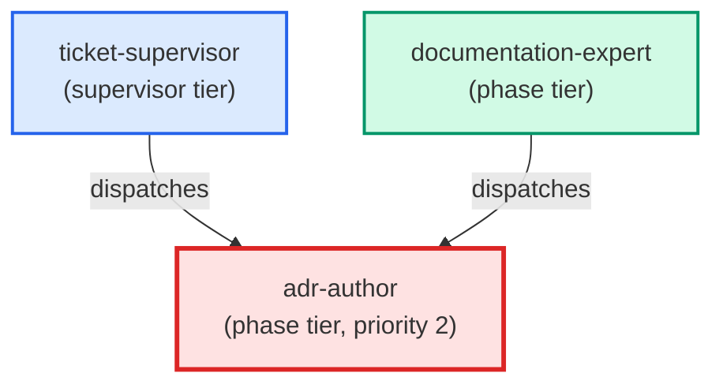

# adr-author

**Authors a new Architecture Decision Record under docs/architecture/.
Loads docs/how-to/documentation/write-adr.md at runtime and lists
docs/architecture/ to pick the next free ADR number before writing.
Produces a correctly-numbered, correctly-templated ADR with all required
sections: Status, Context, Decision, Consequences, Alternatives
(internal — invoked by documentation-expert only).**

| Field | Value |
|-------|-------|
| Model | opus |
| Tier | phase |
| Priority | 2 |
| Portable | Yes |
| Sign-off capable | Yes |

---

## When to Use

### Spawned By

- `ticket-supervisor`
- `documentation-expert`
---

## Knowledge Flow

*No knowledge channels declared.*

---

## Spawn and Dependency

---

## Input / Output Contract

*No structured I/O contract declared.*
---

## Tools Available

| Tool |
|------|
| `Bash` |
| `Read` |
| `Edit` |
| `Write` |
| `Agent` |
---

## Skills Used

*No skills declared.*
---

## Configuration

*No configuration keys declared.*
---

## Contributor Notes

No conditional behaviors — this agent follows a single fixed execution path
