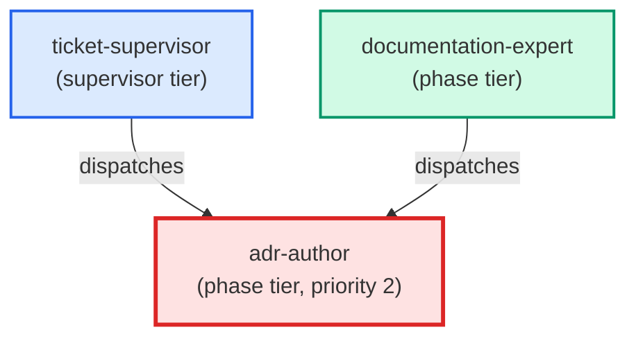

# adr-author

**Authors a new Architecture Decision Record under docs/architecture/.
Loads docs/how-to/documentation/write-adr.md at runtime and lists
docs/architecture/ to pick the next free ADR number before writing.
Produces a correctly-numbered, correctly-templated ADR with all required
sections: Status, Context, Decision, Consequences, Alternatives
(internal — invoked by documentation-expert only).**

| Field | Value |
|-------|-------|
| Model | opus |
| Tier | phase |
| Priority | 2 |
| Portable | Yes |
| Sign-off capable | Yes |

---

## When to Use

### Spawned By

- `ticket-supervisor`
- `documentation-expert`
---

## Knowledge Flow

| Channel | Source | Injection Mode | Description |
|---------|--------|----------------|-------------|
| 1 | template description field | — | — |
| 3 | ticket_path from ticket-supervisor | — | — |
| 4 | pre-flight file reads | — | — |
| 6 | project files read during execution | — | — |
| 7 | bash command output (git, build, tests) | — | — |
---

## Spawn and Dependency

---

## Input / Output Contract

### Inputs

| Name | Type | Description |
|------|------|-------------|
| `ticket_path` | file_path | Absolute path to the ticket markdown file |

### Outputs

| Name | Type | Description |
|------|------|-------------|
| `sign_off_comment` | sign_off_comment | Sign-off comment with status: ok | blocker | handoff |

### Mutates (Side Effects)

| Name | Type | Description |
|------|------|-------------|
| `ticket_frontmatter_agents_status` | — | Sets agents.adr-author to signed_off or failed |
| `sign_offs_checklist` | — | Checks the adr-author checkbox with timestamp |
| `implementation_artifacts` | — | Files created or modified during phase execution |
---

## Tools Available

| Tool |
|------|
| `Bash` |
| `Read` |
| `Edit` |
| `Write` |
| `Agent` |
---

## Skills Used

| Skill | Mode | Condition |
|-------|------|-----------|
| `signoff` | always | — |
| `doc-enforcer` | always | — |
---

## Configuration

*No configuration keys declared.*
---

## Contributor Notes

### Key Behavioral Patterns

| Pattern | Trigger | Behavior | Related Agent |
|---------|---------|----------|---------------|
| Conditional Behavior | choosing `components:` values for the ADR frontmatter | **only pick IDs | `None` |
| Conditional Behavior | uncertain which component applies | pick the closest | `None` |
