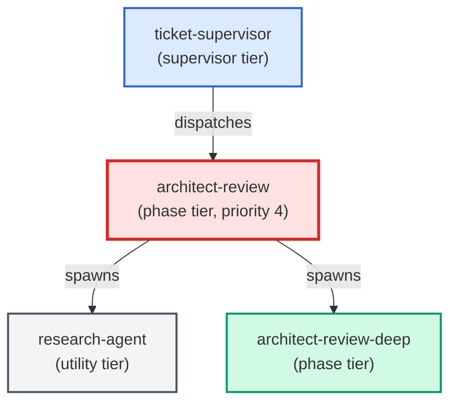

# architect-review

**Structural impact gatekeeper for proposed changes. Receives a refined ticket
from create-ticket, calls research-agent for blast-radius analysis, classifies
impact as small or large using a documented rubric, and either writes an
inline architectural note (Sonnet only) or escalates to an Opus sub-agent.
(internal — invoked by parent agents only)**

| Field | Value |
|-------|-------|
| Model | sonnet |
| Tier | phase |
| Priority | 4 |
| Portable | Yes |
| Sign-off capable | Yes |

---

## When to Use

### Spawned By

- `ticket-supervisor`
---

## Knowledge Flow

| Channel | Source | Injection Mode | Description |
|---------|--------|----------------|-------------|
| 1 | template description field | — | — |
| 3 | ticket_path from ticket-supervisor | — | — |
| 6 | project files read during execution | — | — |
| 7 | bash command output (git, build, tests) | — | — |
---

## Spawn and Dependency

---

## Input / Output Contract

### Inputs

| Name | Type | Description |
|------|------|-------------|
| `ticket_path` | file_path | Absolute path to the ticket markdown file |

### Outputs

| Name | Type | Description |
|------|------|-------------|
| `sign_off_comment` | sign_off_comment | Sign-off comment with status: ok | blocker | handoff |

### Mutates (Side Effects)

| Name | Type | Description |
|------|------|-------------|
| `ticket_frontmatter_agents_status` | — | Sets agents.architect-review to signed_off or failed |
| `sign_offs_checklist` | — | Checks the architect-review checkbox with timestamp |
| `implementation_artifacts` | — | Files created or modified during phase execution |
---

## Tools Available

| Tool |
|------|
| `Bash` |
| `Read` |
| `Edit` |
| `Write` |
| `Agent` |
---

## Skills Used

| Skill | Mode | Condition |
|-------|------|-----------|
| `signoff` | conditional | — |
---

## Configuration

*No configuration keys declared.*
---

## Contributor Notes

### Key Behavioral Patterns

| Pattern | Trigger | Behavior | Related Agent |
|---------|---------|----------|---------------|
| Delegation to adr-author | task requiring adr-author capabilities | Delegates to adr-author via Agent tool | `adr-author` |
| Delegation to architect-review-deep | task requiring architect-review-deep capabilities | Delegates to architect-review-deep via Agent tool | `architect-review-deep` |
| Conditional Behavior | the change introduces a new cross-cutting policy decision (new abstraction | new constraint, new cross-component contract) that is not already covered by an | `None` |
| Conditional Behavior | `requires_adr: true` | also set `adr-author: needed` in the `agents` map | `None` |
