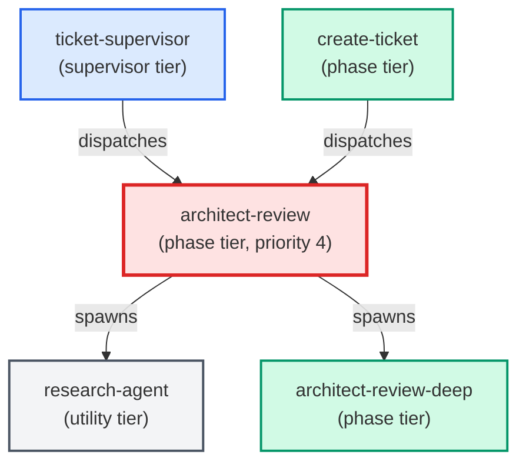

# architect-review

**Structural impact gatekeeper for proposed changes. Receives a refined ticket
from create-ticket, calls research-agent for blast-radius analysis, classifies
impact as small or large using a documented rubric, and either writes an
inline architectural note (Sonnet only) or escalates to an Opus sub-agent.
(internal — invoked by parent agents only)**

| Field | Value |
|-------|-------|
| Model | sonnet |
| Tier | phase |
| Priority | 4 |
| Portable | Yes |
| Sign-off capable | Yes |

---

## When to Use

### Spawned By

- `ticket-supervisor`
- `create-ticket`
---

## Knowledge Flow

*No knowledge channels declared.*

---

## Spawn and Dependency

---

## Input / Output Contract

*No structured I/O contract declared.*
---

## Tools Available

| Tool |
|------|
| `Bash` |
| `Read` |
| `Edit` |
| `Write` |
| `Agent` |
---

## Skills Used

| Skill | Mode | Condition |
|-------|------|-----------|
| `signoff` | — | — |
---

## Configuration

*No configuration keys declared.*
---

## Contributor Notes

No conditional behaviors — this agent follows a single fixed execution path
