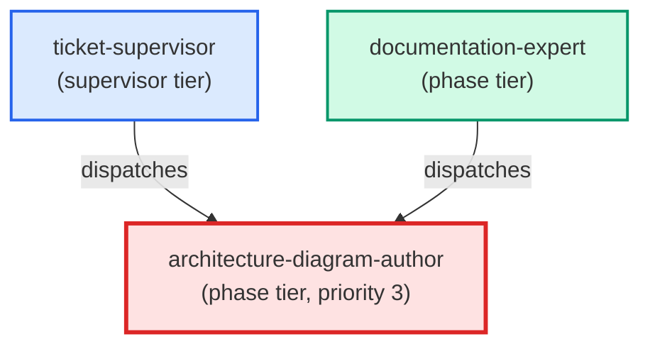

# architecture-diagram-author

**C4 mermaid diagram specialist. Always loads the write-c4-diagram skill
before writing. Validates flight_level selection against the doc's actual
content, produces the mermaid block + frontmatter + cross-links in one pass,
then returns a structured payload with the file path, chosen flight_level,
and rationale.
(internal — dispatched by documentation-expert only, for "design — C4 diagram" intent)**

| Field | Value |
|-------|-------|
| Model | opus |
| Tier | phase |
| Priority | 3 |
| Portable | Yes |
| Sign-off capable | Yes |

---

## When to Use

### Spawned By

- `ticket-supervisor`
- `documentation-expert`
---

## Knowledge Flow

| Channel | Source | Injection Mode | Description |
|---------|--------|----------------|-------------|
| 1 | template description field | — | — |
| 3 | ticket_path from ticket-supervisor | — | — |
| 6 | project files read during execution | — | — |
| 7 | bash command output (git, build, tests) | — | — |
---

## Spawn and Dependency

---

## Input / Output Contract

### Inputs

| Name | Type | Description |
|------|------|-------------|
| `ticket_path` | file_path | Absolute path to the ticket markdown file |

### Outputs

| Name | Type | Description |
|------|------|-------------|
| `sign_off_comment` | sign_off_comment | Sign-off comment with status: ok | blocker | handoff |

### Mutates (Side Effects)

| Name | Type | Description |
|------|------|-------------|
| `ticket_frontmatter_agents_status` | — | Sets agents.architecture-diagram-author to signed_off or failed |
| `sign_offs_checklist` | — | Checks the architecture-diagram-author checkbox with timestamp |
| `implementation_artifacts` | — | Files created or modified during phase execution |
---

## Tools Available

| Tool |
|------|
| `Bash` |
| `Read` |
| `Edit` |
| `Write` |
| `Skill` |
---

## Skills Used

| Skill | Mode | Condition |
|-------|------|-----------|
| `write-c4-diagram` | conditional | — |
---

## Configuration

*No configuration keys declared.*
---

## Contributor Notes

### Key Behavioral Patterns

| Pattern | Trigger | Behavior | Related Agent |
|---------|---------|----------|---------------|
| Stop-and-Ask | condition requiring user decision or out-of-scope action | Do not proceed past Step 1 until the skill is loaded. | `None` |
| Stop-and-Ask | condition requiring user decision or out-of-scope action | do not proceed to Step 3. | `None` |
| Delegation to documentation-expert | task requiring documentation-expert capabilities | Delegates to documentation-expert via Agent tool | `documentation-expert` |
| Delegation to architecture-author | task requiring architecture-author capabilities | Delegates to architecture-author via Agent tool | `architecture-author` |
| Conditional Behavior | a ticket is provided (`ticket_path`) | check whether the ticket body contains | `None` |
| Conditional Behavior | any AC was not satisfied | surface it as a blocker comment rather than signing off | `None` |
