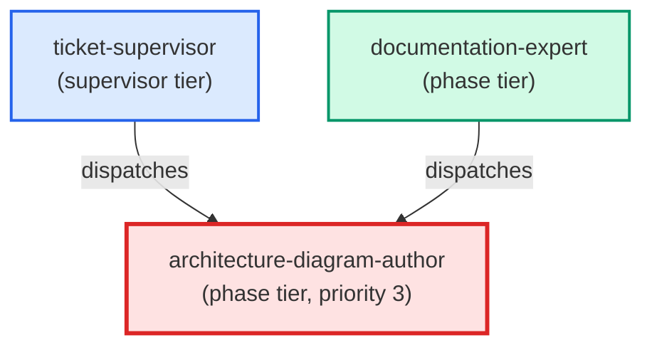

# architecture-diagram-author

**C4 mermaid diagram specialist. Always loads the write-c4-diagram skill
before writing. Validates flight_level selection against the doc's actual
content, produces the mermaid block + frontmatter + cross-links in one pass,
then returns a structured payload with the file path, chosen flight_level,
and rationale.
(internal — dispatched by documentation-expert only, for "design — C4 diagram" intent)**

| Field | Value |
|-------|-------|
| Model | opus |
| Tier | phase |
| Priority | 3 |
| Portable | Yes |
| Sign-off capable | Yes |

---

## When to Use

### Spawned By

- `ticket-supervisor`
- `documentation-expert`
---

## Knowledge Flow

*No knowledge channels declared.*

---

## Spawn and Dependency

---

## Input / Output Contract

*No structured I/O contract declared.*
---

## Tools Available

| Tool |
|------|
| `Bash` |
| `Read` |
| `Edit` |
| `Write` |
| `Skill` |
---

## Skills Used

| Skill | Mode | Condition |
|-------|------|-----------|
| `write-c4-diagram` | — | — |
---

## Configuration

*No configuration keys declared.*
---

## Contributor Notes

No conditional behaviors — this agent follows a single fixed execution path
