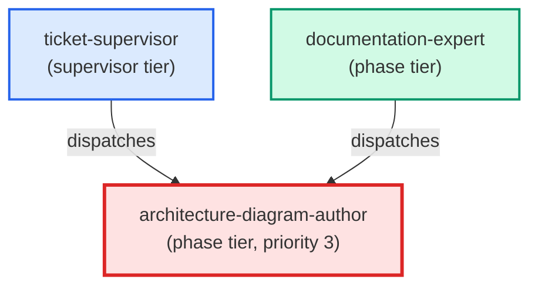

# architecture-diagram-author

**C4 mermaid diagram specialist. Always loads the write-c4-diagram skill
before writing. Validates flight_level selection against the doc's actual
content, produces the mermaid block + frontmatter + cross-links in one pass,
then returns a structured payload with the file path, chosen flight_level,
and rationale.
(internal — dispatched by documentation-expert only, for "design — C4 diagram" intent)**

| Field | Value |
|-------|-------|
| Model | opus |
| Tier | phase |
| Priority | 3 |
| Portable | Yes |
| Sign-off capable | Yes |

---

## When to Use

### Spawned By

- `ticket-supervisor`
- `documentation-expert`
---

## Knowledge Flow

| Channel | Source | Injection Mode | Description |
|---------|--------|----------------|-------------|
| 1 | template description field | — | — |
| 3 | ticket_path from ticket-supervisor | — | — |
| 6 | project files read during execution | — | — |
| 7 | bash command output (git, build, tests) | — | — |
---

## Spawn and Dependency

---

## Input / Output Contract

### Inputs

| Name | Type | Description |
|------|------|-------------|
| `ticket_path` | file_path | Absolute path to the ticket markdown file |

### Outputs

| Name | Type | Description |
|------|------|-------------|
| `sign_off_comment` | sign_off_comment | Sign-off comment with status: ok | blocker | handoff |

### Mutates (Side Effects)

| Name | Type | Description |
|------|------|-------------|
| `ticket_frontmatter_agents_status` | — | Sets agents.architecture-diagram-author to signed_off or failed |
| `sign_offs_checklist` | — | Checks the architecture-diagram-author checkbox with timestamp |
| `implementation_artifacts` | — | Files created or modified during phase execution |
---

## Tools Available

| Tool |
|------|
| `Bash` |
| `Read` |
| `Edit` |
| `Write` |
| `Skill` |
---

## Skills Used

| Skill | Mode | Condition |
|-------|------|-----------|
| `write-c4-diagram` | conditional | — |
---

## Configuration

*No configuration keys declared.*
---

## Contributor Notes

### Key Behavioral Patterns

| Pattern | Trigger | Behavior | Related Agent |
|---------|---------|----------|---------------|
| Stop-and-Ask | condition requiring user decision or out-of-scope action | Do not proceed past Step 1 until the skill is loaded. | `None` |
| Stop-and-Ask | condition requiring user decision or out-of-scope action | do not proceed to Step 3. | `None` |
| Delegation to documentation-expert | task requiring documentation-expert capabilities | Delegates to documentation-expert via Agent tool | `documentation-expert` |
| Delegation to architecture-author | task requiring architecture-author capabilities | Delegates to architecture-author via Agent tool | `architecture-author` |
| Conditional Behavior | a ticket is provided (`ticket_path`) | check whether the ticket body contains | `None` |
| Conditional Behavior | any AC was not satisfied | surface it as a blocker comment rather than signing off | `None` |
---

## AC Assignments

### architecture-diagram-author

- ACD-100a: End-to-end lifecycle flow diagram covers all actors and transitions
- ACD-100a-1: Sequence diagram for the AC authoring pipeline (PO -> BA -> IT PO -> user)
- ACD-100a-2: Sequence diagram for /build-ac execution flow (scan -> generate -> build -> link)
- ACD-100b: Readiness state machine diagram shows all states, transitions, and actors
- ACD-100b-1: Readiness state machine diagram written as Mermaid stateDiagram-v2
- ACD-100d: Component diagram for the AC-driven pipeline (scanner, generator, prioritizer)
- ACD-100d-1: C4 component diagram written at docs/architecture/diagrams/ac-driven-pipeline.md
- ACD-1200g-2: Sequence diagram illustrates the goal-to-epic dispatch flow
- ACD-1600a-3: Sequence diagram of the thin-ticket reference-and-resolve flow
- ACD-1600b-3: Sequence diagram of an agent resolving its spec from the store
- ACD-1700a-3: Component diagram of the role-scoped context injection channels
- ACD-1700c-6: Sequence diagram of assembling an agent's effective prompt
- ACD-1800b-4: Sequence diagram shows the deliverable sign-off flow onto the requirement
- ACD-1800c-4: Sequence diagram shows ticket completion derived from grouped requirement done-state
- ACD-1900b-4: Sequence diagram shows store-first, body-fallback, and halt branches
- ACD-1900c-5: State diagram shows the emit/enforce states and legal transitions
- ACD-2000a-5: State diagram shows a requirement's attempt lifecycle from first try to escalation
- ACD-2000b-3-i: State diagram shows a requirement's claim lifecycle including the reclaim path
- ACS-900e-2: Component diagram shows the boundary between the new hook and the audit script
- BO-1000a-4: Sequence diagram of the start-of-step narration emission path
- BO-1000c-3: Sequence diagram of live progress delivery from background workflow to the conversation
- BO-1300a-4: Sequence diagram: on-demand spot-check pass from invocation to tracked tickets
- BO-1300d-2: Sequence diagram: automatic end-of-build spot-check wiring
- BO-1400a-3: Sequence diagram documents the pre-PR real-data and deployable-placement verification flow
- BO-1500a-3: Sequence diagram of the isolated-authoring worktree lifecycle
- BO-1500a-8: Sequence diagram shows the fail-closed isolation gate and both authoring entry points
- BO-1500b-4: State diagram of the resumable per-stage authoring lifecycle
- BO-1500c-5: Sequence diagram of the approval-to-PR delivery flow
- BO-1600a-4: Sequence diagram of serialized concurrent commits into the shared worktree
- BO-1600b-4: State diagram of a commit's lifecycle through interruption and cleanup
- BO-1600c-4: Sequence diagram of corruption detection halting the drive
- BO-1700a-11: Sequence diagram: probe check flow A -> B -> C -> D -> verdict
- BO-1700c-2: Component diagram: worktree, main tree, .leafcutter, and shared git hooks
- BO-1700c-3: Sequence diagram: commit triggers heal, config resolves, chain fires
- BO-1700d-4: Sequence diagram: probe checkpoints across the worktree lifecycle
- BO-1800a-4: Component diagram of the per-drive isolated-clone topology
- BO-1800a-5: Sequence diagram of the drive create-run-remove lifecycle in an isolated clone
- BO-1800b-4: Sequence diagram of the gated PR-to-merge-queue landing flow
- BO-1900a-3: Sequence diagram documents the read -> preflight -> spawn flow
- BO-1900b-3: Sequence diagram documents the dispatch-time premise re-check
- BO-2100a-5: Sequence diagram of the live-surface-tester dispatch path
- BO-2100a-6: Component diagram of the live-surface-testing pieces and their links
- BO-2100c-4: Sequence diagram of server startup, PID recording, and teardown
- BO-2200d-3: A sequence diagram shows the doc-required ticket phase flow through writer and verifier to commit
- BO-2300a-3: State diagram: run pause/resume lifecycle (running / paused-awaiting-input / resumed / cancelled)
- BO-2300d-2: Sequence diagram: pause -> ask -> answer -> resume interaction
- BO-2400a-7: Sequence diagram: fast-lane loop from selection to commit staging
- BO-2400a-8: Component diagram: fast-lane build path and its collaborators
- BO-2500a-5: Sequence diagram: done-proof evaluation from covers tag to done verdict
- BO-2500d-4: Component diagram: fast-lane vs heavy-pipeline phase order after review retirement
- BO-2900a-5: Sequence diagram: from a done claim to a verdict, including the run observation and the exemption branch
- BO-2900b-5: Component diagram: the capability surface, the automation that runs it, and the two checks between them
- BP-1000a-4: Component diagram of the source-to-shipped parity relationship at the merge gate
- BP-1000b-4: Sequence diagram of the parity gate firing within the finalize-feature merge flow
- BP-1100e-3: A sequence diagram shows where the declared-vs-actual reconciliation sits before done
- BP-1100f-6: Sequence diagram: proving a durable change by its real effect and stated intent
- BP-1100g-7: A sequence diagram shows the promise, the claim, the refusal, and where the boundary to the observer lies
- BP-1200b-2: Sequence diagram documents the PR-to-test-check signal flow
- BP-1400a-3: Sequence diagram documents the web-app CI gate flow from pull request to merge decision
- BP-1400c-2: Sequence diagram documents the web-app route-render check flow
- BP-300d-5: Sequence diagram: runtime-aware routing of a primary delivery command to workflow vs prose fallback
- BP-700a-5: Component diagram shows unified agent in the dispatch topology
- BP-800a-6: Component diagram for the technology detection subsystem
- BP-800b-6: Sequence diagram for the specialist generation pipeline
- BP-800b-7: Component diagram for the specialist generation subsystem
- BP-800e-5: Sequence diagram for the legacy-to-adaptive migration flow
- BP-800f-5: Component diagram for database paradigm detection and specialist generation
- CR-100e-3: Sequence diagram: /code-smell-review invocation to report
- CR-100f-6: Component diagram: core, buckets, leaf agents, orchestration
- CR-100f-7: Sequence diagram: parallel fan-out and merge
- FIN-200a-5: Sequence diagram shows finalize invoking changelog generation
- FIN-200b-3: Sequence diagram shows the entry committed pre-merge and landing in the merge
- FIN-200c-4: State diagram shows the changelog-capture outcomes and their transitions
- GE-104a-4: A sequence diagram documents the two-layer enforcement flow for new-page documentation
- GE-111a-4: Sequence diagram: developer to hook to AC store to commit decision
- GE-111d-5: Sequence diagram: developer reconciles via update or confirm and re-commits
- GE-117d-5: Sequence diagram: the commit-time declaration-enforcement interaction
- GE-117e-4: Sequence diagram: the fix-or-opt-out route out of a declaration block
- GE-119c-5: The new verification surface is drawn as an architecture component
- KM-KGS-100a-4: Component diagram shows the acceptance-criteria store as a knowledge-map surface
- KM-KGS-100b-4: Sequence diagram of a requirement-to-code traversal
- PER-100c-4: Sequence diagram for persona capability query workflow
- PER-100d-4: Sequence diagram for persona context injection flow
- PER-100d-5: Component diagram for persona management system
- TKT-200f-3: Sequence diagram documents clean-tree premise verification before inbox exit
- TKT-500a-5: Sequence diagram: agent dispatch reads AC at source
- TKT-500a-6: Component diagram: AC-as-dispatch-artifact architecture
- TKT-500b-6: Sequence diagram: TDD-first dispatch flow
- TKT-500c-6: State diagram: AC work_status lifecycle
- TKT-500d-5: Sequence diagram: supervisor walking an L0 goal
- TKT-500e-5: Sequence diagram: inject model within a goal
- TKT-500e-6: Component diagram: agent lifecycle within and across goals
- TKT-500f-1: Component diagram: goal-as-dispatch-boundary architecture
- TQ-100b-3: State diagram of a tagged test's informational-to-enforced lifecycle
- TQ-100d-2: State diagram of an allowlist entry's added-tracked-flagged lifecycle
- TQ-400a-6: The component diagram shows one verdict source with three checkers over three populations
- TQ-400b-6: The lifecycle diagram shows done as an exit-able state, with the demotion edge and what it writes
- UXP-100a-4: Component diagram showing the prototype assembly data flow
- UXP-100b-4: Sequence diagram showing gap detection and research initiation flow
- UXP-100c-6: Sequence diagram showing the prototype approval gate lifecycle
- UXP-100d-4: Sequence diagram showing prototype-to-implementation handoff data flow
- UXP-100d-5: Component diagram showing the handoff artifact structure and consumers
- UXP-100e-4: Sequence diagram showing parallel dispatch of UX designer and BA agents
