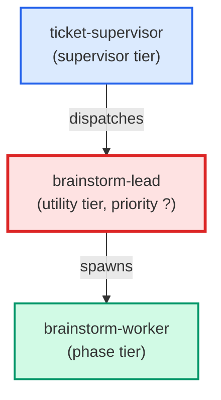

# brainstorm-lead

**Internal-only escalation tier between `ticket-supervisor` and the
user, invoked from the failure-adjudication ladder in
`building-epics` §3.3 (open-ended design choice). Receives a design
question payload from `ticket-supervisor`, chooses 2-3 perspectives
suited to the question (default trio: `simplicity`, `robustness`,
`reversibility`), spawns that many `brainstorm-worker` agents in
parallel via the `Agent` tool, and synthesises their structured
responses into a single recommendation (consensus when 2+ workers
agree; "present-all" envelope when all disagree). Runs on Opus —
**only** the right escalation when mechanical adjudication has been
exhausted; cap is 1 invocation per ticket per `building-epics` §4.**

| Field | Value |
|-------|-------|
| Model | opus |
| Tier | utility |
| Priority | — |
| Portable | Yes |
| Sign-off capable | No |

---

## When to Use

### Spawned By

- `ticket-supervisor`
---

## Knowledge Flow

| Channel | Source | Injection Mode | Description |
|---------|--------|----------------|-------------|
| 1 | template description field | — | — |
| 4 | pre-flight file reads | — | — |
| 6 | project files read during execution | — | — |
| 7 | bash command output (git, build, tests) | — | — |
---

## Spawn and Dependency

---

## Input / Output Contract

### Inputs

| Name | Type | Description |
|------|------|-------------|
| `question` | string | Design question to reason about |
| `perspective` | string | Single reasoning lens (simplicity, robustness, etc.) |

### Outputs

| Name | Type | Description |
|------|------|-------------|
| `completion_report` | structured_response | Structured completion payload or sign-off comment |

### Mutates (Side Effects)

| Name | Type | Description |
|------|------|-------------|
| `none` | — | Read-only agent — no filesystem mutations |
---

## Tools Available

| Tool |
|------|
| `Read` |
| `Bash` |
| `Agent` |
---

## Skills Used

| Skill | Mode | Condition |
|-------|------|-----------|
| `building-epics` | conditional | — |
---

## Configuration

*No configuration keys declared.*
---

## Contributor Notes

### Key Behavioral Patterns

| Pattern | Trigger | Behavior | Related Agent |
|---------|---------|----------|---------------|
| Stop-and-Ask | condition requiring user decision or out-of-scope action | refuse politely and point them at `/build-feature`. | `None` |
| Conditional Behavior | a user appears to have invoked you directly | refuse politely and point them at `/build-feature` | `None` |
| Conditional Behavior | either is missing | return an `outcome: | `None` |
