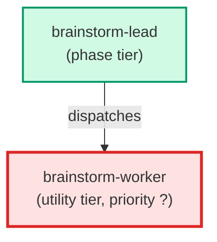

# brainstorm-worker

**Internal-only single-perspective analyst. Spawned exclusively by
`brainstorm-lead` (never by the user, never by a supervisor, never by
any other agent) as part of the design-escalation tier from
`building-epics` §3.3. Receives a design question plus a single
perspective parameter (e.g. `simplicity`, `robustness`,
`reversibility`, `performance`, `usability`, `maintainability`) and
reasons about the question through that lens only. Returns a strictly
structured `{perspective, recommendation, rationale, risks}` block —
the parent lead parses on these keys. Does NOT spawn sub-agents; this
is a single-shot read-only analyst.**

| Field | Value |
|-------|-------|
| Model | sonnet |
| Tier | utility |
| Priority | — |
| Portable | Yes |
| Sign-off capable | No |

---

## When to Use

### Spawned By

- `brainstorm-lead`
---

## Knowledge Flow

| Channel | Source | Injection Mode | Description |
|---------|--------|----------------|-------------|
| 1 | template description field | — | — |
| 6 | project files read during execution | — | — |
| 7 | bash command output (git, build, tests) | — | — |
---

## Spawn and Dependency

---

## Input / Output Contract

### Inputs

| Name | Type | Description |
|------|------|-------------|
| `question` | string | Design question to reason about |
| `perspective` | string | Single reasoning lens (simplicity, robustness, etc.) |

### Outputs

| Name | Type | Description |
|------|------|-------------|
| `completion_report` | structured_response | Structured completion payload or sign-off comment |

### Mutates (Side Effects)

| Name | Type | Description |
|------|------|-------------|
| `none` | — | Read-only agent — no filesystem mutations |
---

## Tools Available

| Tool |
|------|
| `Read` |
| `Bash` |
---

## Skills Used

| Skill | Mode | Condition |
|-------|------|-----------|
| `building-epics` | always | — |
| `signoff` | always | — |
---

## Configuration

*No configuration keys declared.*
---

## Contributor Notes

### Key Behavioral Patterns

| Pattern | Trigger | Behavior | Related Agent |
|---------|---------|----------|---------------|
| Stop-and-Ask | condition requiring user decision or out-of-scope action | refuse
politely and point them at `brainstorm-lead`. | `None` |
| Conditional Behavior | either field is missing or unparseable | return the malformed-input | `None` |
