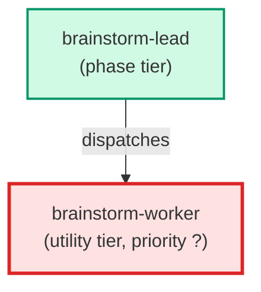

# brainstorm-worker

**Internal-only single-perspective analyst. Spawned exclusively by
`brainstorm-lead` (never by the user, never by a supervisor, never by
any other agent) as part of the design-escalation tier from
`building-epics` §3.3. Receives a design question plus a single
perspective parameter (e.g. `simplicity`, `robustness`,
`reversibility`, `performance`, `usability`, `maintainability`) and
reasons about the question through that lens only. Returns a strictly
structured `{perspective, recommendation, rationale, risks}` block —
the parent lead parses on these keys. Does NOT spawn sub-agents; this
is a single-shot read-only analyst.**

| Field | Value |
|-------|-------|
| Model | sonnet |
| Tier | utility |
| Priority | — |
| Portable | Yes |
| Sign-off capable | No |

---

## When to Use

### Spawned By

- `brainstorm-lead`
---

## Knowledge Flow

*No knowledge channels declared.*

---

## Spawn and Dependency

---

## Input / Output Contract

*No structured I/O contract declared.*
---

## Tools Available

| Tool |
|------|
| `Read` |
| `Bash` |
---

## Skills Used

*No skills declared.*
---

## Configuration

*No configuration keys declared.*
---

## Contributor Notes

No conditional behaviors — this agent follows a single fixed execution path
