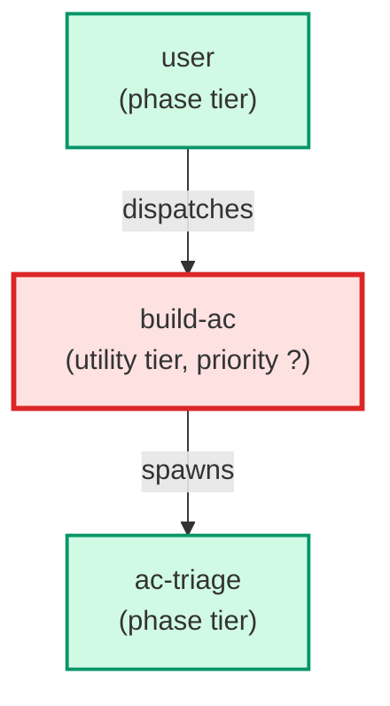

# build-ac

**Entry-point coordinator for the AC-to-ticket-to-build pipeline. Finds
the next highest-priority unimplemented AC via ac_prioritizer.py, generates
a ticket from it via generate_ticket_from_ac.py, surfaces the result to the
user for confirmation (yes / review / skip), and—after the user builds the
ticket manually with /build-feature—marks the AC done via mark_ac_done.py.

DEPTH-CAP NOTE: This agent does NOT call /build-feature inline. Calling
/build-feature from inside this agent would violate Claude Code's depth-1
sub-agent hard limit (build-ac → build-feature → ticket-supervisor = depth 3).
Instead, this agent generates the ticket and hands off to the user to invoke
/build-feature manually. See ADR-006-flatten-supervisor-chain.md.**

| Field | Value |
|-------|-------|
| Model | sonnet |
| Tier | utility |
| Priority | — |
| Portable | Yes |
| Sign-off capable | No |

---

## When to Use

### Spawned By

- `user`
---

## Knowledge Flow

| Channel | Source | Injection Mode | Description |
|---------|--------|----------------|-------------|
| 1 | template description field | — | — |
| 7 | bash command output (ac_prioritizer.py, generate_ticket_from_ac.py, build_ac_mode_detection.py, goal_to_epic.py) | — | — |
---

## Spawn and Dependency

---

## Input / Output Contract

### Inputs

| Name | Type | Description |
|------|------|-------------|
| `arguments` | string | $ARGUMENTS string — may contain --ac <id> to bypass prioritizer, or --dry-run to preview without writing |

### Outputs

| Name | Type | Description |
|------|------|-------------|
| `ticket_path` | file_path | Path to the generated ticket file (single-ticket path); absent on epic-generation path |
| `epic_path` | file_path | Path to the generated epic folder (goal-AC path); absent on single-ticket path |
| `user_prompt` | structured_response | Confirmation prompt shown to the user: AC id, title, priority, and build instruction |
---

## Tools Available

| Tool |
|------|
| `Bash` |
| `Read` |
---

## Skills Used

*No skills declared.*
---

## Configuration

*No configuration keys declared.*
---

## Contributor Notes

### Key Behavioral Patterns

| Pattern | Trigger | Behavior | Related Agent |
|---------|---------|----------|---------------|
| Explicit-AC Override | --ac <id> flag present in $ARGUMENTS | Bypasses ac_prioritizer.py entirely; goes directly to Step 2 using the provided AC id | `None` |
| Dry-Run Mode | --dry-run flag present in $ARGUMENTS | Runs Steps 1 and 2 with --dry-run; prints proposed ticket body; exits without asking the confirmation prompt | `None` |
| Depth-Cap Constraint | User or workflow attempts to call /build-feature inline | Refuses — outputs the ticket path and instructs the user to invoke /build-feature manually to avoid violating depth-1 sub-agent hard limit (ADR-006) | `None` |
| Skip Loop Guard | More than 3 consecutive ACs are skipped in a single session | Stops looping and asks the user to investigate whether the AC store is in a consistent state | `None` |
| Goal-AC Epic Path | detect_ac_mode returns mode: goal (covered_by non-empty, level L0/L1) | Switches to epic-generation path via goal_to_epic.py; does not call generate_ticket_from_ac.py | `None` |
