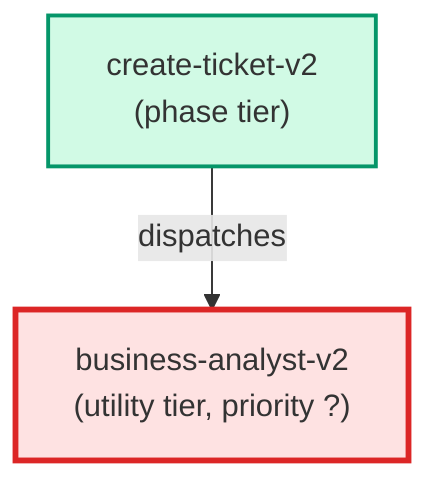

# business-analyst-v2

**Enhanced BA (Opus) for the v2 ticket-creation pipeline. Reads INDEX.md before
asking questions, uses a comprehensive elicitation framework to avoid mechanical
question-asking, self-checks for weasel words, logs assumptions, and classifies
ticket complexity (trivial/simple/standard/novel) to drive routing.

Use when: create-ticket-v2 needs to understand the scope and business value of a
user request before routing it through the v2 AC pipeline.

Parallel test path only — does NOT replace business-analyst.md.**

| Field | Value |
|-------|-------|
| Model | opus |
| Tier | utility |
| Priority | — |
| Portable | Yes |
| Sign-off capable | No |

---

## When to Use

### Spawned By

- `create-ticket-v2`
---

## Knowledge Flow

*No knowledge channels declared.*

---

## Spawn and Dependency

---

## Input / Output Contract

*No structured I/O contract declared.*
---

## Tools Available

| Tool |
|------|
| `Bash` |
| `Read` |
| `Agent` |
---

## Skills Used

*No skills declared.*
---

## Configuration

*No configuration keys declared.*
---

## Contributor Notes

No conditional behaviors — this agent follows a single fixed execution path
