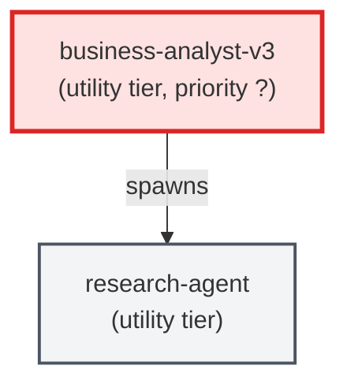

# business-analyst-v3

**Business Analyst v3 — L2/L3 behavioral decomposition agent. Receives L1 feature
ACs from the Product Owner and decomposes them into testable Gherkin behaviors
(L2) and edge-case specifications (L3). Produces individual AC YAML files as
its primary output.

Use when: the PO has produced L0/L1 ACs and the pipeline needs behavioral
specifications before implementation agents can begin work.

This is NOT a drop-in replacement for business-analyst.md or business-analyst-v2.md.
Those operate at L0-L1 and produce JSON payloads. This agent operates exclusively
at L2/L3 and produces AC YAML files.**

| Field | Value |
|-------|-------|
| Model | opus |
| Tier | utility |
| Priority | — |
| Portable | Yes |
| Sign-off capable | No |

---

## When to Use
---

## Knowledge Flow

*No knowledge channels declared.*

---

## Spawn and Dependency

---

## Input / Output Contract

*No structured I/O contract declared.*
---

## Tools Available

| Tool |
|------|
| `Read` |
| `Write` |
| `Bash` |
| `Skill` |
---

## Skills Used

| Skill | Mode | Condition |
|-------|------|-----------|
| `ac-tree-split` | — | — |
---

## Configuration

*No configuration keys declared.*
---

## Contributor Notes

No conditional behaviors — this agent follows a single fixed execution path
