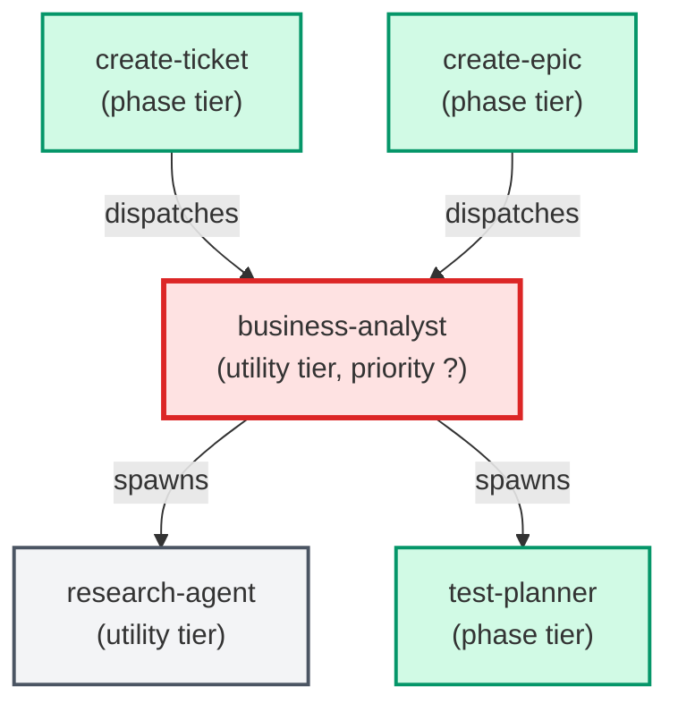

# business-analyst

**Clarifies business intent, value, and success criteria for any ticket
creation request. Always spawned as the first stage of create-ticket.
Returns a structured JSON payload including summary, routing_decision
(standard_ticket or epic), deliverables_count, open_questions,
success_criteria, and test_requirements (produced by test-planner).
Use when: create-ticket needs to understand the scope and business value of
a user request before routing it.**

| Field | Value |
|-------|-------|
| Model | opus |
| Tier | utility |
| Priority | — |
| Portable | Yes |
| Sign-off capable | No |

---

## When to Use

### Spawned By

- `create-ticket`
- `create-epic`
---

## Knowledge Flow

*No knowledge channels declared.*

---

## Spawn and Dependency

---

## Input / Output Contract

*No structured I/O contract declared.*
---

## Tools Available

| Tool |
|------|
| `Bash` |
| `Read` |
| `Agent` |
---

## Skills Used

*No skills declared.*
---

## Configuration

*No configuration keys declared.*
---

## Contributor Notes

No conditional behaviors — this agent follows a single fixed execution path
