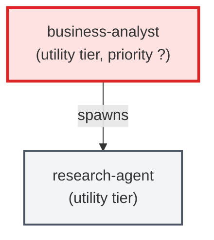

# business-analyst

**Business Analyst — L2/L3 behavioral decomposition agent. Receives L1 feature
ACs from the Product Owner and decomposes them into testable Gherkin behaviors
(L2) and edge-case specifications (L3). Produces individual AC YAML files as
its primary output.

Use when: the PO has produced L0/L1 ACs and the pipeline needs behavioral
specifications before implementation agents can begin work.

This agent operates exclusively at L2/L3 and produces AC YAML files.**

| Field | Value |
|-------|-------|
| Model | opus |
| Tier | utility |
| Priority | — |
| Portable | Yes |
| Sign-off capable | No |

---

## When to Use
---

## Knowledge Flow

| Channel | Source | Injection Mode | Description |
|---------|--------|----------------|-------------|
| 1 | template description field | — | — |
| 6 | project files read during execution | — | — |
| 7 | bash command output (git, build, tests) | — | — |
| 8 | PROJECT_CONTEXT.md | — | — |
---

## Spawn and Dependency

---

## Input / Output Contract

### Outputs

| Name | Type | Description |
|------|------|-------------|
| `completion_report` | structured_response | Structured completion payload or sign-off comment |

### Mutates (Side Effects)

| Name | Type | Description |
|------|------|-------------|
| `none` | — | Read-only agent — no filesystem mutations |
---

## Tools Available

| Tool |
|------|
| `Read` |
| `Write` |
| `Bash` |
| `Skill` |
---

## Skills Used

| Skill | Mode | Condition |
|-------|------|-----------|
| `ac-tree-split` | — | — |
| `knowledge-query` | — | — |
---

## Configuration

*No configuration keys declared.*
---

## Contributor Notes

### Key Behavioral Patterns

| Pattern | Trigger | Behavior | Related Agent |
|---------|---------|----------|---------------|
| Conditional Behavior | a file is absent | unreadable, binary, or exceeds 50 KB | `None` |
| Conditional Behavior | it exists and is ≤ 50 KB of readable text | absorb its contents into your | `None` |
