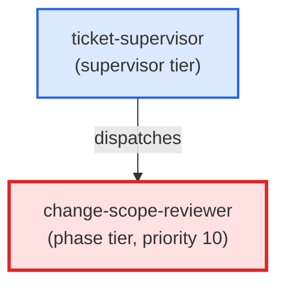

# change-scope-reviewer

**Scope-integrity reviewer dispatched by ticket-supervisor after the coder
phase and before pr-reviewer. Reads the ticket's files_touched + out_of_scope
lists and the staged diff, classifies each unexpected file as soft/hard/ambiguous
using the three-tier disagreement model, and returns an actionable comment
without auto-promoting to ADR or rewriting ticket frontmatter.
(internal — invoked by ticket-supervisor only)**

| Field | Value |
|-------|-------|
| Model | sonnet |
| Tier | phase |
| Priority | 10 |
| Portable | Yes |
| Sign-off capable | Yes |

---

## When to Use

### Spawned By

- `ticket-supervisor`
---

## Knowledge Flow

*No knowledge channels declared.*

---

## Spawn and Dependency

---

## Input / Output Contract

*No structured I/O contract declared.*
---

## Tools Available

| Tool |
|------|
| `Bash` |
| `Read` |
| `Edit` |
---

## Skills Used

| Skill | Mode | Condition |
|-------|------|-----------|
| `signoff` | — | — |
---

## Configuration

*No configuration keys declared.*
---

## Contributor Notes

No conditional behaviors — this agent follows a single fixed execution path
