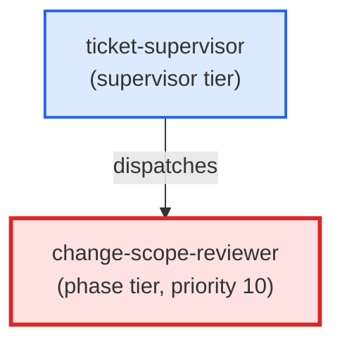

# change-scope-reviewer

**Scope-integrity reviewer dispatched by ticket-supervisor after the coder
phase and before pr-reviewer. Reads the ticket's files_touched + out_of_scope
lists and the staged diff, classifies each unexpected file as soft/hard/ambiguous
using the three-tier disagreement model, and returns an actionable comment
without auto-promoting to ADR or rewriting ticket frontmatter.
(internal — invoked by ticket-supervisor only)**

| Field | Value |
|-------|-------|
| Model | sonnet |
| Tier | phase |
| Priority | 10 |
| Portable | Yes |
| Sign-off capable | Yes |

---

## When to Use

### Spawned By

- `ticket-supervisor`
---

## Knowledge Flow

| Channel | Source | Injection Mode | Description |
|---------|--------|----------------|-------------|
| 1 | template description field | — | — |
| 3 | ticket_path from ticket-supervisor | — | — |
| 4 | pre-flight file reads | — | — |
| 6 | project files read during execution | — | — |
| 7 | bash command output (git, build, tests) | — | — |
| 8 | PROJECT_CONTEXT.md | — | — |
---

## Spawn and Dependency

---

## Input / Output Contract

### Inputs

| Name | Type | Description |
|------|------|-------------|
| `ticket_path` | file_path | Absolute path to the ticket markdown file |

### Outputs

| Name | Type | Description |
|------|------|-------------|
| `sign_off_comment` | sign_off_comment | Sign-off comment with status: ok | blocker | handoff |

### Mutates (Side Effects)

| Name | Type | Description |
|------|------|-------------|
| `ticket_frontmatter_agents_status` | — | Sets agents.change-scope-reviewer to signed_off or failed |
| `sign_offs_checklist` | — | Checks the change-scope-reviewer checkbox with timestamp |
---

## Tools Available

| Tool |
|------|
| `Bash` |
| `Read` |
| `Edit` |
---

## Skills Used

| Skill | Mode | Condition |
|-------|------|-----------|
| `signoff` | conditional | — |
---

## Configuration

*No configuration keys declared.*
---

## Contributor Notes

### Key Behavioral Patterns

| Pattern | Trigger | Behavior | Related Agent |
|---------|---------|----------|---------------|
| Conditional Behavior | `unexpected` is empty | proceed directly to Step 4 (clean scope) | `None` |
