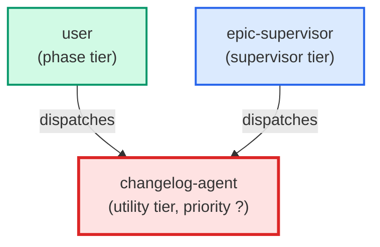

# changelog-agent

**Automated changelog entry agent. Reads git log since the last deployment tag,
categorizes commits by file path and conventional-commit prefixes, and writes
a new per-file changelog entry with YAML frontmatter via emit_entry.py.
Also invoked standalone for on-demand changelog generation between arbitrary
git refs. Does NOT modify the legacy CHANGELOG.md. Use when: /prod-deploy
completes successfully; user invokes /changelog; or epic-supervisor needs a
manual entry. Call site 1 (standalone /changelog and /prod-deploy tail).
(internal — Call site 2 is handled directly by epic-supervisor Step 2.)**

| Field | Value |
|-------|-------|
| Model | sonnet |
| Tier | utility |
| Priority | — |
| Portable | Yes |
| Sign-off capable | No |

---

## When to Use

### Spawned By

- `user`
- `epic-supervisor`
---

## Knowledge Flow

*No knowledge channels declared.*

---

## Spawn and Dependency

---

## Input / Output Contract

*No structured I/O contract declared.*
---

## Tools Available

| Tool |
|------|
| `Bash` |
| `Read` |
| `Write` |
---

## Skills Used

*No skills declared.*
---

## Configuration

| Key | Required | Description |
|-----|----------|-------------|
| `changelog_folder` | — | changelogs/ |
| `changelog_categories_path` | — | .claude/changelog_categories.md |
---

## Contributor Notes

No conditional behaviors — this agent follows a single fixed execution path
