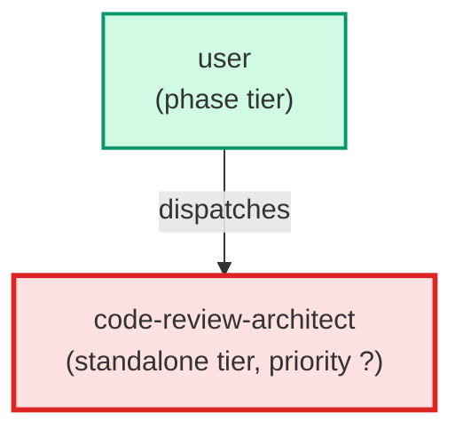

# code-review-architect

**Deep code review agent. Infers requirements and tech stack from the code,
runs an 8-axis review (architecture, coupling, cohesion, TypeScript, complexity,
framework internals, dead code, defects), and writes a prioritised report to a
file. Produces a scorecard and Before/After direction sketches for every finding.
Use when: user asks for a deep code review, architectural review, or quality audit
of existing code; asks "review this feature"; or wants a comprehensive review
beyond what pr-reviewer covers.**

| Field | Value |
|-------|-------|
| Model | opus |
| Tier | standalone |
| Priority | — |
| Portable | Yes |
| Sign-off capable | No |

---

## When to Use

### Spawned By

- `user`
---

## Knowledge Flow

*No knowledge channels declared.*

---

## Spawn and Dependency

---

## Input / Output Contract

*No structured I/O contract declared.*
---

## Tools Available

| Tool |
|------|
| `Bash` |
| `Read` |
| `Write` |
---

## Skills Used

*No skills declared.*
---

## Configuration

*No configuration keys declared.*
---

## Contributor Notes

No conditional behaviors — this agent follows a single fixed execution path
