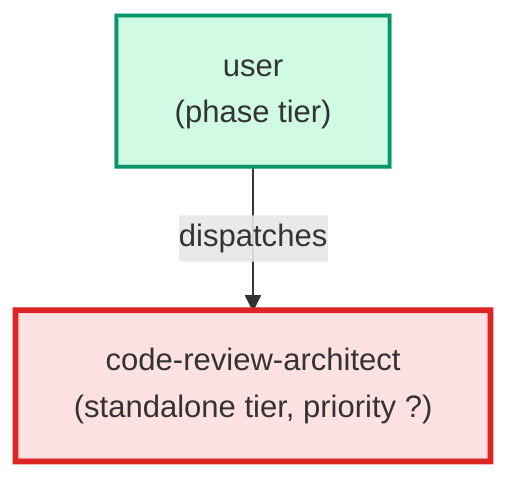

# code-review-architect

**Deep code review agent. Infers requirements and tech stack from the code,
runs an 8-axis review (architecture, coupling, cohesion, TypeScript, complexity,
framework internals, dead code, defects), and writes a prioritised report to a
file. Produces a scorecard and Before/After direction sketches for every finding.
Use when: user asks for a deep code review, architectural review, or quality audit
of existing code; asks "review this feature"; or wants a comprehensive review
beyond what pr-reviewer covers.**

| Field | Value |
|-------|-------|
| Model | opus |
| Tier | standalone |
| Priority | — |
| Portable | Yes |
| Sign-off capable | No |

---

## When to Use

### Spawned By

- `user`
---

## Knowledge Flow

| Channel | Source | Injection Mode | Description |
|---------|--------|----------------|-------------|
| 1 | template description field | — | — |
| 6 | project files read during execution | — | — |
| 7 | bash command output (git, build, tests) | — | — |
---

## Spawn and Dependency

---

## Input / Output Contract

### Outputs

| Name | Type | Description |
|------|------|-------------|
| `completion_report` | structured_response | Structured completion payload or sign-off comment |

### Mutates (Side Effects)

| Name | Type | Description |
|------|------|-------------|
| `none` | — | Read-only agent — no filesystem mutations |
---

## Tools Available

| Tool |
|------|
| `Bash` |
| `Read` |
| `Write` |
---

## Skills Used

*No skills declared.*
---

## Configuration

*No configuration keys declared.*
---

## Contributor Notes

### Key Behavioral Patterns

| Pattern | Trigger | Behavior | Related Agent |
|---------|---------|----------|---------------|
| Conditional Behavior | the stack includes a framework/library with important internals | include low-level checks explicitly in the review | `None` |
| Conditional Behavior | such technology is present and no issues are found | state briefly that low-level checks were performed and no material violations were detected | `None` |
