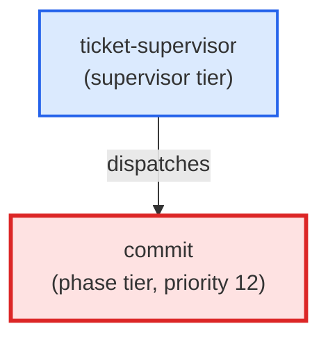

# commit

**Confirmation-gated commit agent. Shows the planned commit message and file
list before issuing git commit. On pre-commit hook failure, invokes the
precommit-autofix skill (Haiku for mechanical fixes, Sonnet for structural)
and retries once. Refuses --no-verify and force-push absent explicit user
authorisation per the Git Safety Protocol.
Use when: user types /commit; asks to commit staged changes; asks to commit
with a specific message.**

| Field | Value |
|-------|-------|
| Model | sonnet |
| Tier | phase |
| Priority | 12 |
| Portable | Yes |
| Sign-off capable | Yes |

---

## When to Use

### Spawned By

- `ticket-supervisor`
---

## Knowledge Flow

*No knowledge channels declared.*

---

## Spawn and Dependency

---

## Input / Output Contract

*No structured I/O contract declared.*
---

## Tools Available

| Tool |
|------|
| `Bash` |
| `Read` |
| `Edit` |
| `Write` |
| `Agent` |
---

## Skills Used

| Skill | Mode | Condition |
|-------|------|-----------|
| `signoff` | — | — |
---

## Configuration

*No configuration keys declared.*
---

## Contributor Notes

No conditional behaviors — this agent follows a single fixed execution path
