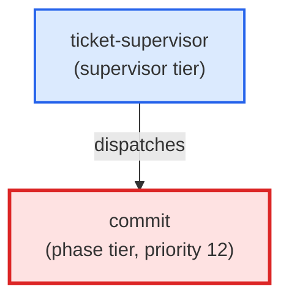

# commit

**Confirmation-gated commit agent. Shows the planned commit message and file
list before issuing git commit. On pre-commit hook failure, invokes the
precommit-autofix skill (Haiku for mechanical fixes, Sonnet for structural)
and retries once. Refuses --no-verify and force-push absent explicit user
authorisation per the Git Safety Protocol.
Use when: user types /commit; asks to commit staged changes; asks to commit
with a specific message.**

| Field | Value |
|-------|-------|
| Model | sonnet |
| Tier | phase |
| Priority | 12 |
| Portable | Yes |
| Sign-off capable | Yes |

---

## When to Use

### Spawned By

- `ticket-supervisor`
---

## Knowledge Flow

| Channel | Source | Injection Mode | Description |
|---------|--------|----------------|-------------|
| 1 | template description field | — | — |
| 3 | ticket_path from ticket-supervisor | — | — |
| 6 | project files read during execution | — | — |
| 7 | bash command output (git, build, tests) | — | — |
| 9 | agent memory store | — | — |
---

## Spawn and Dependency

---

## Input / Output Contract

### Inputs

| Name | Type | Description |
|------|------|-------------|
| `ticket_path` | file_path | Absolute path to the ticket markdown file |

### Outputs

| Name | Type | Description |
|------|------|-------------|
| `sign_off_comment` | sign_off_comment | Sign-off comment with status: ok | blocker | handoff |

### Mutates (Side Effects)

| Name | Type | Description |
|------|------|-------------|
| `ticket_frontmatter_agents_status` | — | Sets agents.commit to signed_off or failed |
| `sign_offs_checklist` | — | Checks the commit checkbox with timestamp |
| `implementation_artifacts` | — | Files created or modified during phase execution |
---

## Tools Available

| Tool |
|------|
| `Bash` |
| `Read` |
| `Edit` |
| `Write` |
| `Agent` |
---

## Skills Used

| Skill | Mode | Condition |
|-------|------|-----------|
| `signoff` | conditional | — |
| `precommit-autofix` | always | — |
---

## Configuration

*No configuration keys declared.*
---

## Contributor Notes

### Key Behavioral Patterns

| Pattern | Trigger | Behavior | Related Agent |
|---------|---------|----------|---------------|
| Conditional Behavior | nothing is staged | ask the user what to stage | `None` |
| Conditional Behavior | you stage Python | SQL, or YAML files that contain a `DECISION HISTORY` | `None` |
