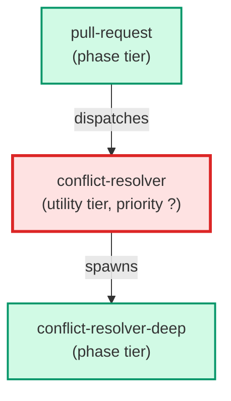

# conflict-resolver

**Resolves merge conflicts in the working tree after a failed merge or
rebase. Classifies each conflict as line-by-line (resolved on Sonnet
inline) or structural (escalated to Opus via conflict-resolver-deep).
Returns a structured payload: resolved_files, escalation, escalation_reason,
unresolved_files.
(internal — invoked by parent agents only)**

| Field | Value |
|-------|-------|
| Model | sonnet |
| Tier | utility |
| Priority | — |
| Portable | Yes |
| Sign-off capable | No |

---

## When to Use

### Spawned By

- `pull-request`
---

## Knowledge Flow

| Channel | Source | Injection Mode | Description |
|---------|--------|----------------|-------------|
| 1 | template description field | — | — |
| 6 | project files read during execution | — | — |
| 7 | bash command output (git, build, tests) | — | — |
---

## Spawn and Dependency

---

## Input / Output Contract

### Outputs

| Name | Type | Description |
|------|------|-------------|
| `completion_report` | structured_response | Structured completion payload or sign-off comment |

### Mutates (Side Effects)

| Name | Type | Description |
|------|------|-------------|
| `none` | — | Read-only agent — no filesystem mutations |
---

## Tools Available

| Tool |
|------|
| `Bash` |
| `Read` |
| `Edit` |
| `Write` |
| `Agent` |
---

## Skills Used

*No skills declared.*
---

## Configuration

*No configuration keys declared.*
---

## Contributor Notes

### Key Behavioral Patterns

| Pattern | Trigger | Behavior | Related Agent |
|---------|---------|----------|---------------|
| Delegation to conflict-resolver-deep | task requiring conflict-resolver-deep capabilities | Delegates to conflict-resolver-deep via Agent tool | `conflict-resolver-deep` |
| Conditional Behavior | the input is absent or incomplete | list conflicted files yourself via | `None` |
| Conditional Behavior | the file is a Python source file | check that no conflict marker | `None` |
