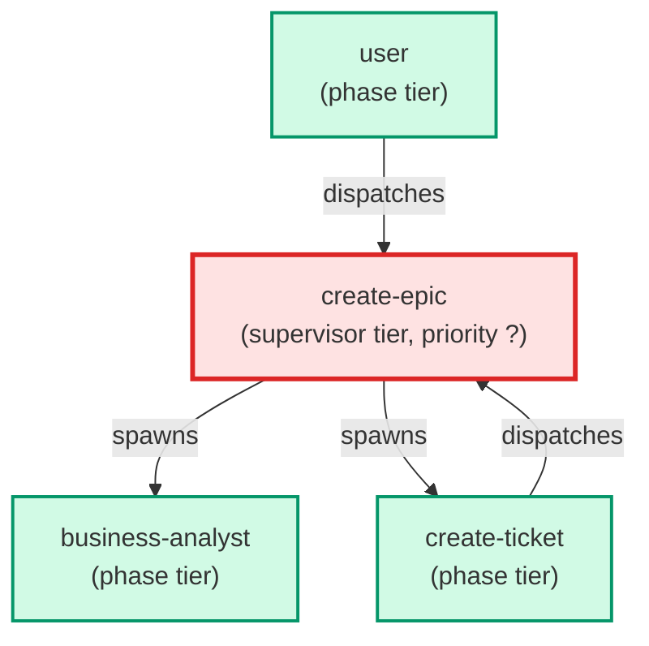

# create-epic

**Scaffolds an epic folder (tickets/00_inbox/epics/EPIC-<Name>/), writes a
Master_Plan.md, generates N stub ticket files, fans out N parallel
create-ticket calls to harden each stub, merges open_questions into one
consolidated user prompt, then runs a final hardening pass with the user's
answers. Invoked by create-ticket when business-analyst sets 
routing_decision to epic (internal — invoked by parent agents only).**

| Field | Value |
|-------|-------|
| Model | haiku |
| Tier | supervisor |
| Priority | — |
| Portable | Yes |
| Sign-off capable | No |

---

## When to Use

### Spawned By

- `user`
- `create-ticket`
---

## Knowledge Flow

*No knowledge channels declared.*

---

## Spawn and Dependency

---

## Input / Output Contract

*No structured I/O contract declared.*
---

## Tools Available

| Tool |
|------|
| `Bash` |
| `Read` |
| `Edit` |
| `Write` |
| `Agent` |
---

## Skills Used

| Skill | Mode | Condition |
|-------|------|-----------|
| `ticket-authoring` | — | — |
---

## Configuration

*No configuration keys declared.*
---

## Contributor Notes

No conditional behaviors — this agent follows a single fixed execution path
