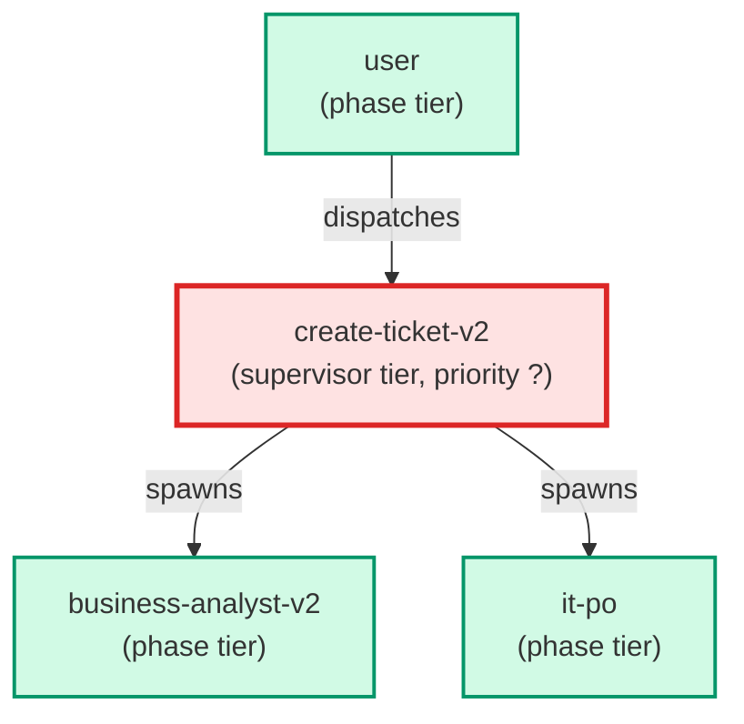

# create-ticket-v2

**Orchestrates v2 ticket creation — parallel pipeline for testing the new AC format.
Runs business-analyst-v2 (Opus) first, then routes by complexity:
  trivial/simple → refinement + flat AC checklist
  standard/novel → it-po + per-agent contracts with Delivers to / Depends on
Produces v2-format tickets with ac_coverage frontmatter and ## Agent Contracts section.

Parallel test path only. v1 pipeline (create-ticket) is unmodified.

Use when: user types /create-ticket-v2; or asks to test the v2 pipeline.**

| Field | Value |
|-------|-------|
| Model | sonnet |
| Tier | supervisor |
| Priority | — |
| Portable | Yes |
| Sign-off capable | No |

---

## When to Use

### Spawned By

- `user`
---

## Knowledge Flow

*No knowledge channels declared.*

---

## Spawn and Dependency

---

## Input / Output Contract

*No structured I/O contract declared.*
---

## Tools Available

| Tool |
|------|
| `Bash` |
| `Read` |
| `Edit` |
| `Write` |
| `Agent` |
---

## Skills Used

| Skill | Mode | Condition |
|-------|------|-----------|
| `ticket-authoring` | — | — |
---

## Configuration

*No configuration keys declared.*
---

## Contributor Notes

No conditional behaviors — this agent follows a single fixed execution path
