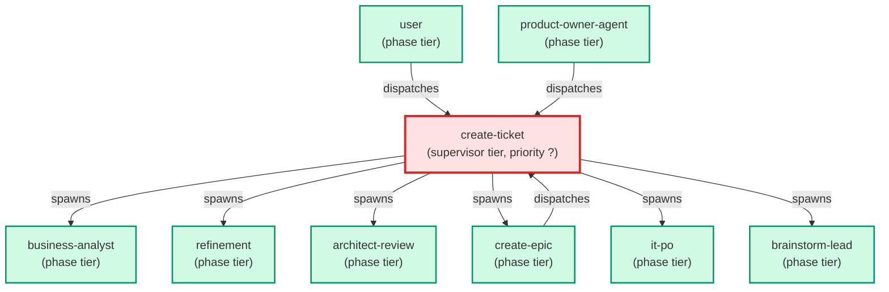

# create-ticket

**Orchestrates ticket creation from any user request — small or large.
Always runs business-analyst first, then routes: ≤3 deliverables spawns
refinement + architect-review in parallel and finalises one ticket;
>3 deliverables defers to create-epic which owns the fanout.
Use when: user types /create-ticket; asks "create a ticket for X";
says "I need a ticket to add Y"; or describes any feature / fix / task
that needs to be captured in tickets/.**

| Field | Value |
|-------|-------|
| Model | sonnet |
| Tier | supervisor |
| Priority | — |
| Portable | Yes |
| Sign-off capable | No |

---

## When to Use

### Spawned By

- `user`
- `create-epic`
- `product-owner-agent`
---

## Knowledge Flow

*No knowledge channels declared.*

---

## Spawn and Dependency

---

## Input / Output Contract

*No structured I/O contract declared.*
---

## Tools Available

| Tool |
|------|
| `Bash` |
| `Read` |
| `Edit` |
| `Write` |
| `Agent` |
---

## Skills Used

| Skill | Mode | Condition |
|-------|------|-----------|
| `ticket-authoring` | — | — |
---

## Configuration

*No configuration keys declared.*
---

## Contributor Notes

No conditional behaviors — this agent follows a single fixed execution path
