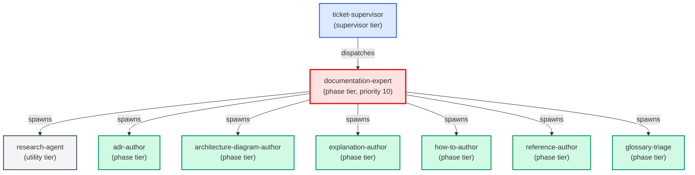

# documentation-expert

**Diataxis-routing documentation orchestrator. Classifies a "write or update
a doc" request by intent (do / decide-record / design / look up / understand),
dispatches to the matching specialist sub-agent (how-to-author, adr-author,
architecture-author, reference-author, explanation-author), and returns a
unified payload listing every doc file produced.
Use when: user says "write a doc for X"; "document this feature"; "add a
how-to for Y"; "write an ADR for Z"; "update the reference for W";
"explain why V works this way"; or asks to "document this end-to-end".
Auto-triggers on any request whose primary verb is "document", "write a doc",
"update a doc", or "add documentation".**

| Field | Value |
|-------|-------|
| Model | sonnet |
| Tier | phase |
| Priority | 10 |
| Portable | Yes |
| Sign-off capable | Yes |

---

## When to Use

### Spawned By

- `ticket-supervisor`
---

## Knowledge Flow

| Channel | Source | Injection Mode | Description |
|---------|--------|----------------|-------------|
| 1 | template description field | — | — |
| 3 | ticket_path from ticket-supervisor | — | — |
| 4 | pre-flight file reads | — | — |
| 6 | project files read during execution | — | — |
| 7 | bash command output (git, build, tests) | — | — |
---

## Spawn and Dependency

---

## Input / Output Contract

### Inputs

| Name | Type | Description |
|------|------|-------------|
| `ticket_path` | file_path | Absolute path to the ticket markdown file |

### Outputs

| Name | Type | Description |
|------|------|-------------|
| `sign_off_comment` | sign_off_comment | Sign-off comment with status: ok | blocker | handoff |

### Mutates (Side Effects)

| Name | Type | Description |
|------|------|-------------|
| `ticket_frontmatter_agents_status` | — | Sets agents.documentation-expert to signed_off or failed |
| `sign_offs_checklist` | — | Checks the documentation-expert checkbox with timestamp |
| `implementation_artifacts` | — | Files created or modified during phase execution |
---

## Tools Available

| Tool |
|------|
| `Bash` |
| `Read` |
| `Edit` |
| `Write` |
| `Agent` |
---

## Skills Used

| Skill | Mode | Condition |
|-------|------|-----------|
| `route-knowledge` | conditional | — |
| `signoff` | conditional | — |
---

## Configuration

*No configuration keys declared.*
---

## Contributor Notes

### Key Behavioral Patterns

| Pattern | Trigger | Behavior | Related Agent |
|---------|---------|----------|---------------|
| Delegation to glossary-triage | task requiring glossary-triage capabilities | Delegates to glossary-triage via Agent tool | `glossary-triage` |
| Delegation to documentation-expert | task requiring documentation-expert capabilities | Delegates to documentation-expert via Agent tool | `documentation-expert` |
| Conditional Behavior | intent is genuinely ambiguous between two types | ask one clarifying | `None` |
| Conditional Behavior | dispatching more than one specialist in a single run | always use this | `None` |
