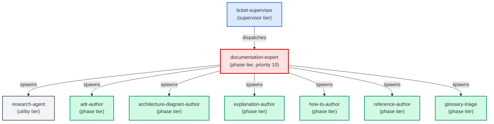

# documentation-expert

**Diataxis-routing documentation orchestrator. Classifies a "write or update
a doc" request by intent (do / decide-record / design / look up / understand),
dispatches to the matching specialist sub-agent (how-to-author, adr-author,
architecture-author, reference-author, explanation-author), and returns a
unified payload listing every doc file produced.
Use when: user says "write a doc for X"; "document this feature"; "add a
how-to for Y"; "write an ADR for Z"; "update the reference for W";
"explain why V works this way"; or asks to "document this end-to-end".
Auto-triggers on any request whose primary verb is "document", "write a doc",
"update a doc", or "add documentation".**

| Field | Value |
|-------|-------|
| Model | sonnet |
| Tier | phase |
| Priority | 10 |
| Portable | Yes |
| Sign-off capable | Yes |

---

## When to Use

### Spawned By

- `ticket-supervisor`
---

## Knowledge Flow

| Channel | Source | Injection Mode | Description |
|---------|--------|----------------|-------------|
| 1 | template description field | — | — |
| 3 | ticket_path from ticket-supervisor | — | — |
| 4 | pre-flight file reads | — | — |
| 6 | project files read during execution | — | — |
| 7 | bash command output (git, build, tests) | — | — |
---

## Spawn and Dependency

---

## Input / Output Contract

### Inputs

| Name | Type | Description |
|------|------|-------------|
| `ticket_path` | file_path | Absolute path to the ticket markdown file |

### Outputs

| Name | Type | Description |
|------|------|-------------|
| `sign_off_comment` | sign_off_comment | Sign-off comment with status: ok | blocker | handoff |

### Mutates (Side Effects)

| Name | Type | Description |
|------|------|-------------|
| `ticket_frontmatter_agents_status` | — | Sets agents.documentation-expert to signed_off or failed |
| `sign_offs_checklist` | — | Checks the documentation-expert checkbox with timestamp |
| `implementation_artifacts` | — | Files created or modified during phase execution |
---

## Tools Available

| Tool |
|------|
| `Bash` |
| `Read` |
| `Edit` |
| `Write` |
| `Agent` |
---

## Skills Used

| Skill | Mode | Condition |
|-------|------|-----------|
| `route-knowledge` | conditional | — |
| `signoff` | conditional | — |
| `direct-write` | conditional | glossary coverage lint — agent writes directly to docs/glossary.md and docs/glossary_blacklist.md for simple glossary updates, without spawning a specialist |
---

## Configuration

*No configuration keys declared.*
---

## Contributor Notes

### Key Behavioral Patterns

| Pattern | Trigger | Behavior | Related Agent |
|---------|---------|----------|---------------|
| Delegation to glossary-triage | task requiring glossary-triage capabilities | Delegates to glossary-triage via Agent tool | `glossary-triage` |
| Delegation to documentation-expert | task requiring documentation-expert capabilities | Delegates to documentation-expert via Agent tool | `documentation-expert` |
| Conditional Behavior | intent is genuinely ambiguous between two types | ask one clarifying | `None` |
| Conditional Behavior | dispatching more than one specialist in a single run | always use this | `None` |
---

## AC Assignments

### documentation-expert

- ACD-100c: How-to guide for using /build-ac and the AC-driven workflow
- ACD-100c-1: How-to guide written at docs/how-to/ac-driven-development.md
- ACD-1200b-3: How-to guide documents the approval gate workflow for unapproved ACs
- ACD-1200e-3: How-to guide documents the unified /build-ac leaf-vs-goal behavior
- ACD-1200g-1: How-to guide documents the goal-to-epic workflow for users
- ACS-900a-3: How-to guide and sequence diagram for the retirement-detection trigger
- ACS-900b-3: How-to guide and sequence diagram for the retirement-blocks-commit behavior
- ACS-900c-2: How-to guide documents the block message and how to act on it
- ACS-900d-3: How-to guide documents the legitimate-pass cases so the check is trusted
- BO-1300a-3: How-to guide: requesting an independent spot-check of a finished feature
- BO-1500c-4: How-to guide for delivering approved ACs via the reviewed PR path
- BP-1000c-2: How-to guide for reading a parity failure and resolving the drift it names
- BP-1000d-2: Reference doc defining which scripts are in scope for the parity check and which are exempt
- BP-100b-10: Drift hook docs include a developer checklist for adding new template categories
- BP-100b-8: Build pipeline diagram includes the workflow scripts phase
- BP-100b-9: Consolidated output root doc lists .claude/workflows/ as a shimmed output
- BP-1200a-2: The CI test command is documented as the single authoritative way to run the suite from a clean checkout
- BP-200c-4: Agents README documents llm-expert in the phase agents table
- BP-300a-7: debug.md falls back to prose skill for older Claude Code runtimes
- BP-300a-8: SKILL.md contains supersession note for debug.js
- BP-700a-4: How-to guide documents design integration for adopters
- BP-700c-5: Reference document catalogues all preserved capabilities
- BP-700d-4: How-to guide documents upgrade path for existing adopters
- BP-800a-5: How-to guide for technology detection
- BP-800b-5: How-to guide for adaptive specialist generation
- BP-800c-4: Reference documentation for the best-practice knowledge layer
- BP-800d-4: How-to guide for legacy agent retirement
- BP-800e-4: How-to guide for upgrading from legacy agent layout
- BP-800f-4: Reference documentation for database paradigm support
- FIN-200a-4: How-to guide documents the automatic changelog step
- GE-102e: The pre-commit hooks how-to documents the new transform hooks and their silent auto-fix behavior
- GE-104a-3: A how-to guide ships with the page-documentation guardrail so operators can configure and respond to it
- GE-111a-3: How-to guide: reconciling a blocked commit when a refactor breaks an AC link
- GE-111b-4: Reference doc: the file-vs-symbol resolution model and #symbol anchor contract
- GE-111d-4: How-to guide: the two routes to reconcile a flagged AC link
- INF-300a-1: Knowledge surface map documents all surfaces with when-to-use rules
- KM-KGS-100b-3: How-to guide for tracing a requirement to its code and tests
- KM-KGS-100c-3: How-to guide for declaring a new knowledge surface
- PER-100a-4: How-to guide for creating and maintaining personas
- PER-100a-5: Reference doc for persona YAML schema
- PER-100b-4: How-to guide for tagging ACs with persona references
- PER-100b-5: Reference doc for persona_for AC field
- PER-100c-3: How-to guide for querying capabilities by persona
- PER-100e-4: How-to guide for creating and refining personas with the persona expert
- UXP-100a-3: How-to guide for assembling prototypes from the component library
- UXP-100c-5: How-to guide for reviewing and deciding on a prototype
