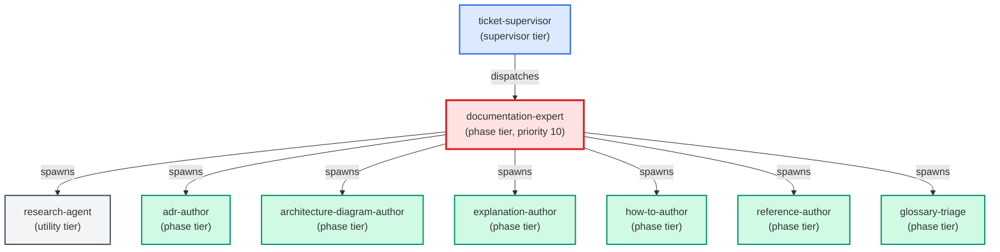

# documentation-expert

**Diataxis-routing documentation orchestrator. Classifies a "write or update
a doc" request by intent (do / decide-record / design / look up / understand),
dispatches to the matching specialist sub-agent (how-to-author, adr-author,
architecture-author, reference-author, explanation-author), and returns a
unified payload listing every doc file produced.
Use when: user says "write a doc for X"; "document this feature"; "add a
how-to for Y"; "write an ADR for Z"; "update the reference for W";
"explain why V works this way"; or asks to "document this end-to-end".
Auto-triggers on any request whose primary verb is "document", "write a doc",
"update a doc", or "add documentation".**

| Field | Value |
|-------|-------|
| Model | sonnet |
| Tier | phase |
| Priority | 10 |
| Portable | Yes |
| Sign-off capable | Yes |

---

## When to Use

### Spawned By

- `ticket-supervisor`
---

## Knowledge Flow

| Channel | Source | Injection Mode | Description |
|---------|--------|----------------|-------------|
| 1 | template description field | — | — |
| 3 | ticket_path from ticket-supervisor | — | — |
| 4 | pre-flight file reads | — | — |
| 6 | project files read during execution | — | — |
| 7 | bash command output (git, build, tests) | — | — |
---

## Spawn and Dependency

---

## Input / Output Contract

### Inputs

| Name | Type | Description |
|------|------|-------------|
| `ticket_path` | file_path | Absolute path to the ticket markdown file |

### Outputs

| Name | Type | Description |
|------|------|-------------|
| `sign_off_comment` | sign_off_comment | Sign-off comment with status: ok | blocker | handoff |

### Mutates (Side Effects)

| Name | Type | Description |
|------|------|-------------|
| `ticket_frontmatter_agents_status` | — | Sets agents.documentation-expert to signed_off or failed |
| `sign_offs_checklist` | — | Checks the documentation-expert checkbox with timestamp |
| `implementation_artifacts` | — | Files created or modified during phase execution |
---

## Tools Available

| Tool |
|------|
| `Bash` |
| `Read` |
| `Edit` |
| `Write` |
| `Agent` |
---

## Skills Used

| Skill | Mode | Condition |
|-------|------|-----------|
| `route-knowledge` | conditional | — |
| `signoff` | conditional | — |
| `direct-write` | conditional | — |
---

## Configuration

*No configuration keys declared.*
---

## Contributor Notes

### Key Behavioral Patterns

| Pattern | Trigger | Behavior | Related Agent |
|---------|---------|----------|---------------|
| Delegation to glossary-triage | task requiring glossary-triage capabilities | Delegates to glossary-triage via Agent tool | `glossary-triage` |
| Delegation to documentation-expert | task requiring documentation-expert capabilities | Delegates to documentation-expert via Agent tool | `documentation-expert` |
| Conditional Behavior | intent is genuinely ambiguous between two types | ask one clarifying | `None` |
| Conditional Behavior | dispatching more than one specialist in a single run | always use this | `None` |
---

## AC Assignments

### documentation-expert

- ACD-100c: How-to guide for using /build-ac and the AC-driven workflow
- ACD-100c-1: How-to guide written at docs/how-to/ac-driven-development.md
- ACD-1200b-3: How-to guide documents the approval gate workflow for unapproved ACs
- ACD-1200e-3: How-to guide documents the unified /build-ac leaf-vs-goal behavior
- ACD-1200g-1: How-to guide documents the goal-to-epic workflow for users
- ACD-1600a-4: Reference doc for the thin-ticket (reference-not-copy) convention
- ACD-1600c-3: Reference doc for the implementation-readiness completeness gate
- ACD-1600d-3: Reference doc for the canonical-source pointer rule
- ACD-1600e-3: Reference doc for the behaviour-only criteria rule
- ACD-1600f-3: Reference doc for the AC-vs-supporting-artifact consistency gate
- ACD-1600g-5: Reference doc describes the requirement boundary and its bundle composition rule
- ACD-1700a-4: Reference doc for role-scoped context delivery
- ACD-1700b-3: Reference doc for the surface-to-specialist assignment rule
- ACD-1700c-5: How-to guide for previewing an agent's brief before a build
- ACD-1800a-3: Reference doc describes the requirement deliverable checklist
- ACD-1800b-3: Reference doc describes per-deliverable sign-off and requirement-level done
- ACD-1800c-3: Reference doc describes the ticket-as-grouping model
- ACD-1800d-2: Reference doc describes per-deliverable traceability back-references
- ACD-1800f-5: Reference doc describes how a requirement declares an observable promise and states its proof
- ACD-1900a-4: Reference doc describes schema_version and the new optional fields
- ACD-1900c-4: How-to guide covers operating the flag and its kill-switches
- ACD-1900d-5: How-to guide covers the advisory-to-required gate rollout
- ACD-1900e-5: How-to guide covers running the opt-in backfill safely
- ACD-1900f-4: How-to guide covers upgrade and the compatibility-window lifecycle
- ACD-1900g-4: How-to guide covers the dogfood proof and the go/no-go checklist
- ACD-2000a-4: Reference doc describes the requirement's adjudication trail and its retry budget
- ACD-2000b-5: Reference doc describes how a requirement is taken, handed back, and reclaimed
- ACD-2100d-4: A reference page states which copy of the route runs and where a repair has to land
- ACD-2100e-2: A how-to guide takes an operator from a waiting run back to a running one
- ACS-1200a-3: The written back-link rule matches the enforced one
- ACS-1200d-4: The how-to tells you how to park an idea and how to take it back out
- ACS-1300a-4: Someone who did not build the repair can preview it, run it, and read what it did
- ACS-1300c-4: The refusal is written down beside the field it protects, where the next tool author will find it
- ACS-500g-2-ii: A how-to guide walks a reader from a noticed repetition to a referenced pattern
- ACS-900a-3: How-to guide and sequence diagram for the retirement-detection trigger
- ACS-900b-3: How-to guide and sequence diagram for the retirement-blocks-commit behavior
- ACS-900c-2: How-to guide documents the block message and how to act on it
- ACS-900d-3: How-to guide documents the legitimate-pass cases so the check is trusted
- AGC-100c-2: How to build and verify Codex-native Leafcutter agents
- AGC-100f-2: Reference for the Codex agent compatibility contract
- BO-1300a-3: How-to guide: requesting an independent spot-check of a finished feature
- BO-1500c-4: How-to guide for delivering approved ACs via the reviewed PR path
- BO-1700a-10: How-to guide: proving pre-commit protection is live in a worktree
- BO-1800b-1: The hub's main accepts changes only through a pull request; direct push, force-push, and branch deletion are rejected server-side
- BO-1800b-1-i: An agent's direct push to main is rejected at the hub
- BO-1800b-2: Merges to main are performed by the merge queue only after required checks pass
- BO-1800b-3: No privileged bypass exists, and agents authenticate as a least-privilege identity with no direct-push right
- BO-1800b-3-i: An admin merge attempt on main is rejected outside the gate
- BO-1800b-5: Reference doc for the hub main-branch protection and merge-queue configuration
- BO-1800c-4: Reference doc for the two parallelism axes and the resource-aware scheduler
- BO-1800e-4: Reference doc for the no-shared-local-main model and read-only main sync
- BO-2100b-4: How-to guide for turning live-app testing on for a project and a feature
- BO-2100b-5: Reference documentation for the live_surface_testing config block
- BO-2100d-4: How-to guide for diagnosing a live-app check that cannot run
- BO-2200c-6: A reference doc explains the documentation-coverage gate, the verifier, and the Agent Contracts brief
- BO-2400a-6: How-to: run the fast-lane build loop for a cohesive batch
- BO-2400b-4: How-to: choose the right build path (fast lane vs heavy pipeline)
- BO-2400c-1-vii: The bundle's reference page describes the function that exists
- BO-2400c-4: Reference: fast-lane prompt caching (layout, TTL, prefix reuse)
- BO-2400d-4: Reference: build telemetry record schema and lane tagging
- BO-2400d-5: How-to: generate and read the fast-lane vs heavy-pipeline comparison report
- BO-2500a-4: How-to: prove an AC is done with a passing covers-linked test
- BO-2500b-4: How-to: local pre-commit proof-of-done feedback and the required CI gate
- BO-2500c-4: How-to: author real-artifact fixtures and round-trip tests
- BO-2500c-5: Reference: fixture policy and real-producer fixture rules
- BO-2600b-3: How-to: what a fast-lane run picks up when you aim it at one criterion
- BO-2900a-4: How-to: prove a criterion done through the real way in, and what to do when the guard refuses
- BO-2900b-4: How-to: keep capabilities and their automation connected in both directions
- BO-2900c-3: How-to: the reverse-direction content of the connection guide — stale calls, renames and removals
- BO-2900d-4: How-to: decide whether to wire code in or exempt it, and record the exemption
- BO-2900d-5: Reference: the exemption contract — what is recorded, what it covers, and how it appears in output
- BO-2900e-4: How-to: one table mapping every refusal the guard can emit to the action that clears it
- BO-2900f-5: Reference documentation states the skipped-gate record contract and its boundary with the workflow-step record
- BP-1000c-2: How-to guide for reading a parity failure and resolving the drift it names
- BP-1000d-2: Reference doc defining which scripts are in scope for the parity check and which are exempt
- BP-100b-10: Drift hook docs include a developer checklist for adding new template categories
- BP-100b-8: Build pipeline diagram includes the workflow scripts phase
- BP-100b-9: Consolidated output root doc lists .claude/workflows/ as a shimmed output
- BP-1100a-5: The guidance on getting a generated ticket's surface right describes the derivation that actually runs
- BP-1200a-2: The CI test command is documented as the single authoritative way to run the suite from a clean checkout
- BP-1500d-5: The published reference tells an adopter where their record lives and how to tell an inert check from a passing one
- BP-200c-4: Agents README documents llm-expert in the phase agents table
- BP-300a-7: debug.md falls back to prose skill for older Claude Code runtimes
- BP-300a-8: SKILL.md contains supersession note for debug.js
- BP-700a-4: How-to guide documents design integration for adopters
- BP-700c-5: Reference document catalogues all preserved capabilities
- BP-700d-4: How-to guide documents upgrade path for existing adopters
- BP-800a-5: How-to guide for technology detection
- BP-800b-5: How-to guide for adaptive specialist generation
- BP-800c-4: Reference documentation for the best-practice knowledge layer
- BP-800d-4: How-to guide for legacy agent retirement
- BP-800e-4: How-to guide for upgrading from legacy agent layout
- BP-800f-4: Reference documentation for database paradigm support
- BP-900g-8-iii: The written deploy-dependency rule names data and configuration files, not only imported modules
- CR-100a-4: Reference doc: the code-smell finding anatomy and named catalogue
- CR-100d-3: Reference doc: severity rubric and consolidated report format
- CR-100e-2: How-to guide: running /code-smell-review on a file, folder, or snippet
- FIN-100c-10: How-to guide describes the null-baseline targeted rerun, not the old blanket-halt
- FIN-200a-4: How-to guide documents the automatic changelog step
- GE-102e: The pre-commit hooks how-to documents the new transform hooks and their silent auto-fix behavior
- GE-104a-3: A how-to guide ships with the page-documentation guardrail so operators can configure and respond to it
- GE-111a-3: How-to guide: reconciling a blocked commit when a refactor breaks an AC link
- GE-111b-4: Reference doc: the file-vs-symbol resolution model and #symbol anchor contract
- GE-111d-4: How-to guide: the two routes to reconcile a flagged AC link
- GE-116a-6: Reference documentation covers the agent-definition consistency guard
- GE-117a-2: How-to guide: naming your file's component in the module docstring
- GE-117b-3: How-to guide: citing the AC a public function or class satisfies
- GE-117c-2: How-to guide: the extended decision-history tail-tag with ticket and AC references
- GE-117d-4: How-to guide: understanding and clearing a declaration-guardrail block
- GE-117e-3: How-to guide: fixing a missing declaration or deliberately opting out
- GE-120a-5: The no-silent-pass rule is written where the next check author will find it
- GE-120b-5: The manual link-the-layout workaround is deleted, not left standing beside the fix
- GE-120d-5: The how-to states what a prepared working copy guarantees and how to confirm it
- GE-120e-5: The attribution rule is written where the next check author decides how to get their diff
- GE-122a-3: The numbering rules for all four namespaces are written down in one place
- GE-122b-3: An author with no prior knowledge can find out how to get a number
- GE-122b-4: Which locations must carry a number, and which need not, is written down
- GE-122c-3: A person blocked where nobody can be brought in has a procedure to follow
- GE-122d-5: Which stage you can skip, and what still catches you, is written down
- GE-123c-4: Someone writing their first suppression can find out how to write one instead of copying a neighbouring line
- GE-124a-4: A how-to shows where the declaration goes in each front-end file shape
- GE-124b-4: A how-to shows an author how to pin one element to one criterion
- GE-124b-5: One reference doc holds the data-ac contract for all of its consumers
- GE-124c-4: A how-to tells a blocked author which of the two mistakes they made and how to clear it
- GE-124d-4: A how-to shows how to record an opt-out and how an area gets onto the warn list
- GE-124e-5: A how-to separates 'nothing claims this' from 'nothing proves this' for the person who hit the gate
- GE-124g-5: A reference doc states what each kind of evidence is worth, for every future check
- GE-126a-4: The written procedure for interrogating a check yourself is one you can follow and trust
- GE-126a-5: The target contract a check owes its caller is written down once
- GE-126b-4: The three answers a check can give are written down with the evidence that produced them
- GE-126c-4: Which copy of a check is the one that enforces is written down where an author will read it
- GE-126d-4: Following the procedure for adding a check leaves nothing to discover later
- GE-126d-5: What each registration leg buys you is written down beside the list of legs
- GE-126e-5: The first measured answer is published with the question that produced it
- INF-300a-1: Knowledge surface map documents all surfaces with when-to-use rules
- INF-700b-5: Reference documentation states what the capture step requires of an agent, and names only steps that exist
- INF-700c-3: Reference documentation states what may be written as knowledge and what the waiting count means
- KM-KGS-100b-3: How-to guide for tracing a requirement to its code and tests
- KM-KGS-100c-3: How-to guide for declaring a new knowledge surface
- KM-KGS-100e-7: How-to guide: declare a component on a knowledge item and query it back
- PER-100a-4: How-to guide for creating and maintaining personas
- PER-100a-5: Reference doc for persona YAML schema
- PER-100b-4: How-to guide for tagging ACs with persona references
- PER-100b-5: Reference doc for persona_for AC field
- PER-100c-3: How-to guide for querying capabilities by persona
- PER-100e-4: How-to guide for creating and refining personas with the persona expert
- TQ-400a-5: Someone who has never run the store-wide sweep can run it and read its verdict unaided
- TQ-400b-7: The field reference answers type, nullability, writer and never-rewritten for both demotion fields
- TQ-400c-5: A reader can change the cadence and find the latest published verdict from the guide alone
- TQ-400d-5: A first-time triager can work a record from the pile to a recorded decision using the guide alone
- TQ-400e-6: The exemption reference states when a declaration is honoured, when refused, and which records may carry one
- TQ-500d-2: A how-to that names the exception and walks through taking the substitute evidence
- TQ-500e-3: Reference documentation defining the answer's recorded form and every state it can hold
- UXP-100a-3: How-to guide for assembling prototypes from the component library
- UXP-100c-5: How-to guide for reviewing and deciding on a prototype
- UXP-606: How-to: read decision diamonds in the Atlas Flows view
