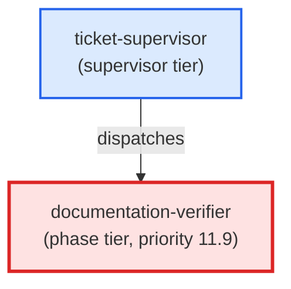

# documentation-verifier

**Conditional phase agent that reads the `## Agent Contracts` -> `### documentation-expert` block from the ticket body and asserts that each required documentation file named in that block has a real git diff change. Guards against phantom-done documentation defects (documentation announced but not written). Fails with status: blocker — naming each missing file — when any required doc is absent from the diff. Fail-closed: an ambiguous parse or exception emits status: blocker, never status: ok. Priority 11.9 — after documentation-expert (10), pr-reviewer (11), user-surface-smoker (11.5), and live-surface-tester (11.8); before commit (12). Conditional on requires_documentation_verification != null in ticket frontmatter. This is the documentation analogue of the BP-1100 phantom-done enforcement posture — do NOT fold it into that family. Use when: ticket-supervisor dispatches this agent at priority 11.9 for a ticket whose requires_documentation_verification field is non-null.**

| Field | Value |
|-------|-------|
| Model | sonnet |
| Tier | phase |
| Priority | 11.9 |
| Portable | Yes |
| Sign-off capable | Yes |

---

## When to Use

### Spawned By

- `ticket-supervisor`
---

## Knowledge Flow

| Channel | Source | Injection Mode | Description |
|---------|--------|----------------|-------------|
| 1 | template description field | — | — |
| 3 | ticket_path from ticket-supervisor | — | — |
| 6 | project files read during execution | — | — |
| 7 | bash command output (git, build, tests) | — | — |
| 9 | agent memory store | — | — |
---

## Spawn and Dependency

---

## Input / Output Contract

### Inputs

| Name | Type | Description |
|------|------|-------------|
| `ticket_path` | file_path | Absolute path to the ticket markdown file |

### Outputs

| Name | Type | Description |
|------|------|-------------|
| `sign_off_comment` | sign_off_comment | Sign-off comment with status: ok | blocker |

### Mutates (Side Effects)

| Name | Type | Description |
|------|------|-------------|
| `ticket_frontmatter_agents_status` | — | Sets agents.documentation-verifier to signed_off or failed |
| `sign_offs_checklist` | — | Checks the documentation-verifier checkbox with timestamp |
---

## Tools Available

| Tool |
|------|
| `Bash` |
| `Read` |
| `Edit` |
---

## Skills Used

| Skill | Mode | Condition |
|-------|------|-----------|
| `signoff` | always | — |
---

## Configuration

*No configuration keys declared.*
---

## Contributor Notes

### Key Behavioral Patterns

| Pattern | Trigger | Behavior | Related Agent |
|---------|---------|----------|---------------|
| Stop-and-Ask | condition requiring user decision or out-of-scope action | Do not proceed. | `None` |
| Fail on missing doc | any required documentation file named in the Agent Contracts brief is absent from git diff HEAD | emit `(status: blocker)` naming each required doc absent from the git diff | `None` |
| Fail-closed on parse error | Agent Contracts block is absent on a v2 ticket, malformed, or raises an exception during parse | emit `(status: blocker)` — never status: ok on ambiguous or failed parse | `None` |
| Fail on placeholder content | a required doc is present in the diff but contains TODO/PLACEHOLDER/Replace with/FIXME/QUESTION/TBD markers, unfilled {token} patterns, or is an empty or heading-only stub | emit `(status: blocker)` naming each file and the placeholder marker found | `None` |
| Fail-closed on script error | python3 invocation of scripts/build_placeholder_detection.py exits non-zero or cannot be imported | emit `(status: blocker)` — never status: ok when the helper script exits non-zero or raises an exception | `None` |
