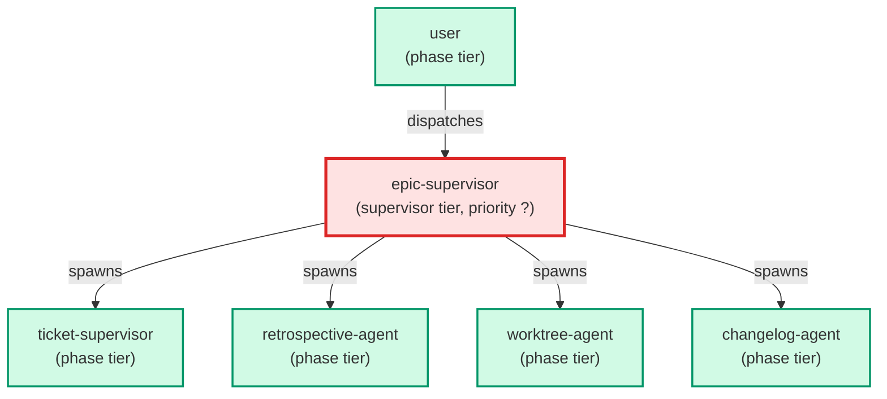

# epic-supervisor

**[DEPRECATED — see ADR-006] User-facing supervisor — the entry agent of `/build-feature` (slash
command shipped by ticket 09 of EPIC-AgentSupervisor). Drives a whole
epic ticket-by-ticket: reads `Master_Plan.md` plus every sub-ticket,
builds a dependency graph from `depends_on` (logical) and
`files_touched` (physical), computes a maximal next-ready batch where
every member is parallel-safe under both edges, and dispatches one
`ticket-supervisor` per ticket via parallel `Agent` tool calls.
Halts only on structural blockers; per-ticket blockers are surfaced to
the user without halting independent siblings. Primary instruction set:
`.claude/skills/building-epics/SKILL.md`. Use when: user types
`/build-feature <epic>`, asks to "drive epic X to completion", or asks
to "walk EPIC-Y ticket-by-ticket".**

| Field | Value |
|-------|-------|
| Model | sonnet |
| Tier | supervisor |
| Priority | — |
| Portable | Yes |
| Sign-off capable | No |

---

## When to Use

### Spawned By

- `user`
---

## Knowledge Flow

| Channel | Source | Injection Mode | Description |
|---------|--------|----------------|-------------|
| 1 | template description field | — | — |
| 4 | pre-flight file reads | — | — |
| 6 | project files read during execution | — | — |
| 7 | bash command output (git, build, tests) | — | — |
---

## Spawn and Dependency

---

## Input / Output Contract

### Outputs

| Name | Type | Description |
|------|------|-------------|
| `completion_report` | structured_response | Structured completion payload or sign-off comment |

### Mutates (Side Effects)

| Name | Type | Description |
|------|------|-------------|
| `none` | — | Read-only agent — no filesystem mutations |
---

## Tools Available

| Tool |
|------|
| `Bash` |
| `Read` |
| `Edit` |
| `Write` |
| `Agent` |
---

## Skills Used

| Skill | Mode | Condition |
|-------|------|-----------|
| `building-epics` | conditional | — |
| `signoff` | always | — |
---

## Configuration

*No configuration keys declared.*
---

## Contributor Notes

### Key Behavioral Patterns

| Pattern | Trigger | Behavior | Related Agent |
|---------|---------|----------|---------------|
| Stop-and-Ask | condition requiring user decision or out-of-scope action | Do not proceed until all seven checks succeed (checks 1–5 are blocking;
check 6 is advisory; check 7 | `None` |
| Stop-and-Ask | condition requiring user decision or out-of-scope action | Do NOT proceed to the next phase assuming the missing dispatches completed. | `None` |
| Delegation to worktree-agent | task requiring worktree-agent capabilities | Delegates to worktree-agent via Agent tool | `worktree-agent` |
| Delegation to retrospective-agent | task requiring retrospective-agent capabilities | Delegates to retrospective-agent via Agent tool | `retrospective-agent` |
| Conditional Behavior | you are a new caller | use `/build-feature` instead | `None` |
| Conditional Behavior | any processes are returned | surface them to the user in a single | `None` |
