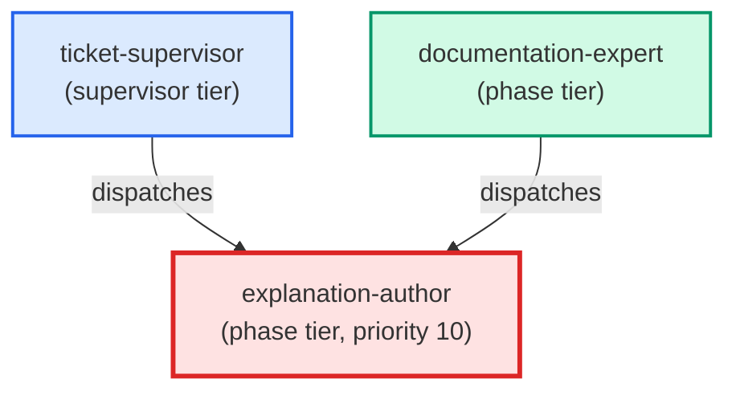

# explanation-author

**Diataxis "understand" specialist. Produces understanding-oriented explanation
docs — concept explainers and "why-it-works-this-way" discussions — by loading
the canonical how-to before writing. Applies a genre guard and hands back to
the correct specialist when the request is not "understand".
(internal — invoked by documentation-expert only)**

| Field | Value |
|-------|-------|
| Model | sonnet |
| Tier | phase |
| Priority | 10 |
| Portable | Yes |
| Sign-off capable | Yes |

---

## When to Use

### Spawned By

- `ticket-supervisor`
- `documentation-expert`
---

## Knowledge Flow

| Channel | Source | Injection Mode | Description |
|---------|--------|----------------|-------------|
| 1 | template description field | — | — |
| 3 | ticket_path from ticket-supervisor | — | — |
| 6 | project files read during execution | — | — |
| 7 | bash command output (git, build, tests) | — | — |
---

## Spawn and Dependency

---

## Input / Output Contract

### Inputs

| Name | Type | Description |
|------|------|-------------|
| `ticket_path` | file_path | Absolute path to the ticket markdown file |

### Outputs

| Name | Type | Description |
|------|------|-------------|
| `sign_off_comment` | sign_off_comment | Sign-off comment with status: ok | blocker | handoff |

### Mutates (Side Effects)

| Name | Type | Description |
|------|------|-------------|
| `ticket_frontmatter_agents_status` | — | Sets agents.explanation-author to signed_off or failed |
| `sign_offs_checklist` | — | Checks the explanation-author checkbox with timestamp |
| `implementation_artifacts` | — | Files created or modified during phase execution |
---

## Tools Available

| Tool |
|------|
| `Bash` |
| `Read` |
| `Edit` |
| `Write` |
| `Agent` |
---

## Skills Used

| Skill | Mode | Condition |
|-------|------|-----------|
| `signoff` | always | — |
---

## Configuration

*No configuration keys declared.*
---

## Contributor Notes

### Key Behavioral Patterns

| Pattern | Trigger | Behavior | Related Agent |
|---------|---------|----------|---------------|
| Stop-and-Ask | condition requiring user decision or out-of-scope action | Do not proceed from memory. | `None` |
| Delegation to adr-author | task requiring adr-author capabilities | Delegates to adr-author via Agent tool | `adr-author` |
| Delegation to architecture-author | task requiring architecture-author capabilities | Delegates to architecture-author via Agent tool | `architecture-author` |
| Delegation to how-to-author | task requiring how-to-author capabilities | Delegates to how-to-author via Agent tool | `how-to-author` |
| Conditional Behavior | a ticket is provided (`ticket_path`) | check whether the ticket body contains | `None` |
| Conditional Behavior | writing the explanation: add required sections | ensure required concepts | `None` |
