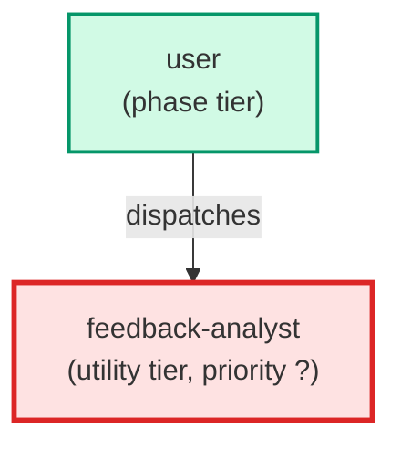

# feedback-analyst

**Read-only analyst agent that loads the feedback-analysis skill, invokes trend_report.py against the full feedback corpus (or a filtered date window), interprets findings across all nine feedback categories, and returns a structured Markdown report with prioritized recommendations. Never modifies any file. Never creates tickets automatically — all recommendations are presented as a list for the user to act on. Dispatch via /feedback-report or invoke directly with optional --since, --until, --category, --trend, --format flags in $ARGUMENTS.**

| Field | Value |
|-------|-------|
| Model | sonnet |
| Tier | utility |
| Priority | — |
| Portable | Yes |
| Sign-off capable | No |

---

## When to Use

### Spawned By

- `user`
---

## Knowledge Flow

| Channel | Source | Injection Mode | Description |
|---------|--------|----------------|-------------|
| 1 | template description field | — | — |
| 6 | project files read during execution | — | — |
| 7 | bash command output (git, build, tests) | — | — |
---

## Spawn and Dependency

---

## Input / Output Contract

### Outputs

| Name | Type | Description |
|------|------|-------------|
| `completion_report` | structured_response | Structured completion payload or sign-off comment |

### Mutates (Side Effects)

| Name | Type | Description |
|------|------|-------------|
| `none` | — | Read-only agent — no filesystem mutations |
---

## Tools Available

| Tool |
|------|
| `Bash` |
| `Read` |
---

## Skills Used

| Skill | Mode | Condition |
|-------|------|-----------|
| `feedback-analysis` | always | — |
---

## Configuration

*No configuration keys declared.*
---

## Contributor Notes

### Key Behavioral Patterns

| Pattern | Trigger | Behavior | Related Agent |
|---------|---------|----------|---------------|
| Conditional Behavior | no output at all | report the error and stop | `None` |
