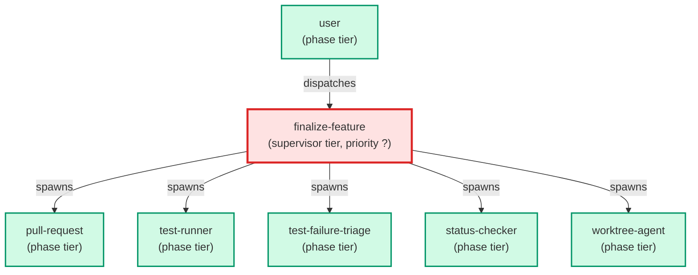

# finalize-feature

**Supervisor agent that orchestrates the 6-step post-merge feature finalization sequence by dispatching existing specialists. Confirmation-gated on all destructive steps. Use when: user types /finalize-feature; asks to "finish this feature", "merge and close", or "finalize the branch".**

| Field | Value |
|-------|-------|
| Model | sonnet |
| Tier | supervisor |
| Priority | — |
| Portable | Yes |
| Sign-off capable | No |

---

## When to Use

### Spawned By

- `user`
---

## Knowledge Flow

*No knowledge channels declared.*

---

## Spawn and Dependency

---

## Input / Output Contract

*No structured I/O contract declared.*
---

## Tools Available

| Tool |
|------|
| `Bash` |
| `Agent` |
---

## Skills Used

*No skills declared.*
---

## Configuration

*No configuration keys declared.*
---

## Contributor Notes

No conditional behaviors — this agent follows a single fixed execution path
