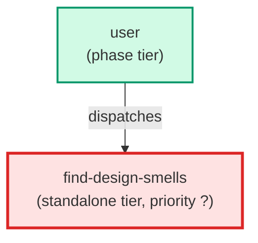

# find-design-smells

**Reviews code for the six cross-cutting / judgment Fowler code smells — Global Data,
Mutable Data, Feature Envy, Data Clumps, Primitive Obsession, Shotgun Surgery — and points
each at its named refactoring. Runs on Opus: these need whole-target reasoning about data
flow, ownership, and change locality. Loads the review-for-code-smells core skill plus the
design bucket skill and RETURNS its findings (it does not write a file). Usually dispatched
in parallel by the code-smell-review orchestration alongside find-structural-smells; also
runnable standalone.
Use when: the design half of a code-smell review is needed, or the user wants the deep
judgment-level smell pass.**

| Field | Value |
|-------|-------|
| Model | opus |
| Tier | standalone |
| Priority | — |
| Portable | Yes |
| Sign-off capable | No |

---

## When to Use

### Spawned By

- `user`
---

## Knowledge Flow

| Channel | Source | Injection Mode | Description |
|---------|--------|----------------|-------------|
| 1 | template description field | — | — |
| 6 | project files read during execution | — | — |
| 7 | bash command output (git, build, tests) | — | — |
---

## Spawn and Dependency

---

## Input / Output Contract

### Outputs

| Name | Type | Description |
|------|------|-------------|
| `findings` | structured_response | Design-bucket findings sections in the review-for-code-smells format |

### Mutates (Side Effects)

| Name | Type | Description |
|------|------|-------------|
| `none` | — | Read-only reviewer — no filesystem mutations |
---

## Tools Available

| Tool |
|------|
| `Bash` |
| `Read` |
| `Skill` |
---

## Skills Used

| Skill | Mode | Condition |
|-------|------|-----------|
| `review-for-code-smells` | — | — |
| `review-for-design-code-smells` | — | — |
---

## Configuration

*No configuration keys declared.*
---

## Contributor Notes

### Key Behavioral Patterns

| Pattern | Trigger | Behavior | Related Agent |
|---------|---------|----------|---------------|
| Conditional Behavior | invoked as part of an orchestrated code-smell-review | return only the findings sections (Summary rows, HIGH/MEDIUM/LOW findings, Scorecard rows) for the orchestrator to merge | `find-structural-smells` |
| Conditional Behavior | invoked standalone with no orchestrator | emit the full standalone report instead of findings-only sections | `None` |
| Delegation | a mechanical/local smell is spotted while scanning the design bucket | note the smell in one line for the structural reviewer and do not fully work it up | `find-structural-smells` |
