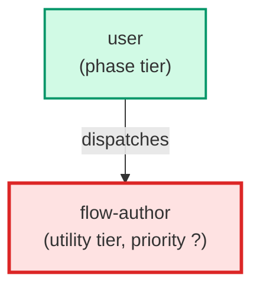

# flow-author

**Flow authoring agent for the product-truth store. Given drafted mock data and
mockups for a multi-step request, it assembles a draft flow (*.flow.json): steps
ordered and each wired to its screen and the entities it reads and writes, with one
acceptance_scenario per step the business-analyst can turn into ACs. It follows the
add-vs-create rule — extending an existing journey when a screen belongs to one
rather than creating a new flow. Output conforms to flow.schema.json.

Use when: the product-truth classifier (pt-classifier) returns needs_flow (outcome
full-set) — a multi-step journey — and the mock data and mockups have been drafted,
so the journey wiring can be assembled before the business-analyst derives the ACs.**

| Field | Value |
|-------|-------|
| Model | opus |
| Tier | utility |
| Priority | — |
| Portable | Yes |
| Sign-off capable | No |

---

## When to Use

### Spawned By

- `user`
---

## Knowledge Flow

| Channel | Source | Injection Mode | Description |
|---------|--------|----------------|-------------|
| 1 | template description field | — | — |
| 6 | product-truth store files read during execution (README, schema, gold seed, mockups, mock data, index.json) | — | — |
| 7 | bash command output (generate_product_truth.py, validate_product_truth.py) | — | — |
---

## Spawn and Dependency

---

## Input / Output Contract

### Outputs

| Name | Type | Description |
|------|------|-------------|
| `flow_artifact` | structured_response | A drafted or extended *.flow.json artifact plus a completion report |

### Mutates (Side Effects)

| Name | Type | Description |
|------|------|-------------|
| `flow` | — | Product-truth flow artifacts and the index.json artifacts[] entry |
---

## Tools Available

| Tool |
|------|
| `Read` |
| `Write` |
| `Edit` |
| `Bash` |
---

## Skills Used

*No skills declared.*
---

## Configuration

*No configuration keys declared.*
---

## Contributor Notes

### Key Behavioral Patterns

| Pattern | Trigger | Behavior | Related Agent |
|---------|---------|----------|---------------|
| Conditional Behavior | a screen belongs to an existing flow | extend the existing journey rather than create a new flow | `None` |
| Conditional Behavior | a store file is missing | absent, unreadable, or oversized | `None` |
---

## AC Assignments

### flow-author

- UXP-542: A flow agent assembles the draft flow, wiring each step to its screen and entities
