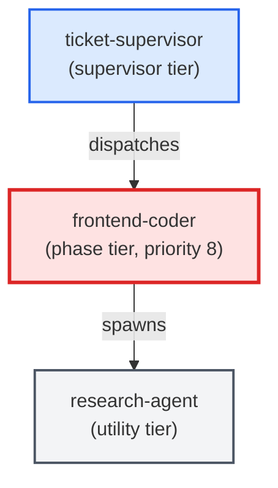

# frontend-coder

**Standards-enforcing frontend/UI implementation agent. Writes, edits, and
refactors HTML, CSS, JavaScript, TypeScript, React, Vue, Svelte, and other
web-layer files. Loads optional webapp-testing skill when installed. Embeds
design principles directly (does NOT load the legacy frontend-design skill
even if present). Delegates Python logic to python-coder and SQL changes to
sql-coder via Stop-and-Ask rules.

Use when: ticket involves creating or modifying frontend/UI components,
markup, or styles; ticket requires visual changes to a web interface;
files_touched contains .tsx, .jsx, .vue, .svelte, .html, .css, or .scss.

See ADR-005 for the sibling-agent design rationale.**

| Field | Value |
|-------|-------|
| Model | sonnet |
| Tier | phase |
| Priority | 8 |
| Portable | Yes |
| Sign-off capable | Yes |

---

## When to Use

### Spawned By

- `ticket-supervisor`
---

## Knowledge Flow

| Channel | Source | Injection Mode | Description |
|---------|--------|----------------|-------------|
| 1 | template description field | — | — |
| 3 | ticket_path from ticket-supervisor | — | — |
| 4 | pre-flight file reads | — | — |
| 5 | skills_config.json config_keys | — | — |
| 6 | project files read during execution | — | — |
| 7 | bash command output (git, build, tests) | — | — |
| 8 | PROJECT_CONTEXT.md | — | — |
---

## Spawn and Dependency

---

## Input / Output Contract

### Inputs

| Name | Type | Description |
|------|------|-------------|
| `ticket_path` | file_path | Absolute path to the ticket markdown file |

### Outputs

| Name | Type | Description |
|------|------|-------------|
| `sign_off_comment` | sign_off_comment | Sign-off comment with status: ok | blocker | handoff |

### Mutates (Side Effects)

| Name | Type | Description |
|------|------|-------------|
| `ticket_frontmatter_agents_status` | — | Sets agents.frontend-coder to signed_off or failed |
| `sign_offs_checklist` | — | Checks the frontend-coder checkbox with timestamp |
| `implementation_artifacts` | — | Files created or modified during phase execution |
---

## Tools Available

| Tool |
|------|
| `Bash` |
| `Read` |
| `Edit` |
| `Write` |
| `Agent` |
---

## Skills Used

| Skill | Mode | Condition |
|-------|------|-----------|
| `webapp-testing` | conditional | — |
| `signoff` | conditional | — |
---

## Configuration

| Key | Required | Description |
|-----|----------|-------------|
| `ui_context_path` | No | Path to the UI context pointer file (default: docs/ui-context.md). Configurable so projects that place the file elsewhere can override at build time. |
| `frontend.project_context_path` | No | Path to PROJECT_CONTEXT.md for the frontend-coder agent (default: .agents/agents/frontend-coder/PROJECT_CONTEXT.md) |
| `frontend.optional_skills` | No | List of installed optional skill names (e.g. [webapp-testing]). Note: frontend-design is no longer an optional skill — design principles are embedded in this template. |
| `frontend.test_command` | No | Command to run the frontend test suite after changes (e.g. npm test, yarn vitest) |
---

## Contributor Notes

### Key Behavioral Patterns

| Pattern | Trigger | Behavior | Related Agent |
|---------|---------|----------|---------------|
| Stop-and-Ask | condition requiring user decision or out-of-scope action | Halt immediately. | `None` |
| Delegation to research-agent | task requiring research-agent capabilities | Delegates to research-agent via Agent tool | `research-agent` |
| Delegation to python-coder | task requiring python-coder capabilities | Delegates to python-coder via Agent tool | `python-coder` |
| Delegation to sql-coder | task requiring sql-coder capabilities | Delegates to sql-coder via Agent tool | `sql-coder` |
| Conditional Behavior | installed:** After making UI changes | invoke the webapp-testing skill by | `None` |
| Conditional Behavior | a `Delivers to:` item is ambiguous | add a one-line comment in the code and | `None` |
---

## AC Assignments

### frontend-coder

- BO-2100a-3: build-ticket.js phase ordering includes live-surface-tester after the smoker and before commit
- BO-2100a-3-i: Relative phase order 11.5 < 11.8 < 12 is preserved after insertion
- TQ-200a-2-iii: MARKUP output is scored by schema, render, and data-binding checks plus a visual judge
- UXP-100d-2: Frontend-coder agent consumes the handoff artifact without human translation
- UXP-210a: Customer can browse the plant catalogue
- UXP-210b: Customer can open a plant's detail and add it to the cart
- UXP-210b-2: Out-of-stock plant offers a notify-me action instead of add-to-cart
- UXP-210c: Customer can review the cart before paying
- UXP-210c-2: Empty cart shows an empty state instead of a checkout
- UXP-210d: Customer can check out and pay
- UXP-210d-2: Declined payment is handled without creating an order
- UXP-210d-3: Plant that sold out after being carted blocks checkout
- UXP-210d-4: Order summary is shown before payment
- UXP-210d-5: Entering payment details creates a Payment record
- UXP-210d-6: Successful authorization captures the Payment and marks the Order paid
- UXP-210e: Customer sees an order confirmation
- UXP-210f: Customer signs in before checkout and keeps their cart
- UXP-220a: Customer can see a list of their past orders
- UXP-220a-2: Customer with no orders sees an empty state
- UXP-220b: Customer can open an order to see its details
- UXP-220c: Customer can track the shipment of a paid order
- UXP-220c-2: Paid-but-not-dispatched order shows tracking-unavailable state
- UXP-410: The /flows loader reads the flow and index JSON from the product-truth store
- UXP-410a: The loader discovers every flow file in the store rather than a hardcoded list
- UXP-412: The resolved flow is drawn as a graph on the Atlas /flows page
- UXP-412a: Each rendered step is colour-coded by its resolved work_status
- UXP-421: The Atlas reads the product-truth store live and renders its flows
- UXP-421a: The Atlas /flows view colours each step live from the acceptance-criteria store
- UXP-515: Mockup is a first-class artifact type whose screen resolves from flow steps
- UXP-520: The Flows view lists flows and renders the selected one as a graph
- UXP-521: A source toggle filters flows by mock vs real
- UXP-522: A kind chooser filters flows by user/data/architecture
- UXP-523: Opening a step shows its ACs' live status, the mock records it uses, and its mockup
- UXP-524: An AC node links to the flows it appears in
- UXP-544: pt-classifier is dispatched once after ac-triage and the run-set is derived from its outcome
- UXP-544a: An unparseable or inconsistent classifier result skips the product-truth phase but still runs the AC pipeline
- UXP-544b: The product-truth agents run in a fixed order regardless of classifier list order
- UXP-545: Each product-truth stage is gated (approve/edit/cancel) and committed under a plan-feature(<STAGE>) subject
- UXP-545a: A product-truth stage commit refuses to run against the main branch
- UXP-545b: A failed product-truth stage commit aborts the phase before the next agent runs
- UXP-545c: Cancelling at a product-truth gate opens no PR and preserves prior committed stages
- UXP-546: Product-truth stage commits stage only the reported artifact paths plus index.json
- UXP-547: An approved flow is handed to the business-analyst to derive ACs, forcing BA in when the route skipped it
- UXP-549: Crash-resume recognizes committed product-truth stages, skips them, and recovers the flow reference
- UXP-550: One repoRoot() seam swaps the entire Atlas to the fixture repo when mock mode is active
- UXP-551: A bundled fixture repo mirrors each loader input's native format so all Atlas views render populated
- UXP-551-1: The JSON entity mock-data records are repurposed directly as test fixtures, no separate authoring
- UXP-552: A visible mock-mode badge tells the reviewer the Atlas is showing fixtures
- UXP-553: LEAFCUTTER_MOCK env sets the default mock state; a runtime override takes precedence
- UXP-553-1: An optional production lock forbids runtime overrides so a deployment can guarantee real data
- UXP-554: A drift guard validates fixtures against real schemas and parses each through its native-format loader in CI
- UXP-595a: When the product-truth store is absent the phase self-skips with an observable signal and AC authoring proceeds
- UXP-597: A conditional fork renders as a decision diamond showing its condition, distinct from a step card
- UXP-598: Decision edges are labelled: the branch outcome rides the 'yes' edge, 'no'/else continues to the next step
- UXP-599: A multi-branch fork chains into diamonds (diamond -> diamond -> happy path), not one N-way node
- UXP-599a: Known limitation: a branch off the LAST step does not synthesize a diamond
- UXP-600: Diamonds and their edges are derived from the existing flow branch data
- UXP-600a: Forward-dependency boundary: the first-class decisions[] schema is out of scope for this backfill
- UXP-601: Decision and outcome nodes tint by their derived impl_status
- UXP-602: Individual AC nodes are off by default in the flow graph
- UXP-603: Each step/branch shows a compact, status-tinted done/total ACs progress pill
- UXP-603a: A node with zero acceptance criteria shows no progress pill
- UXP-604: A feature-level deduped 'N/M ACs done' rollup is shown for the whole flow
- UXP-604a: An AC referenced by multiple nodes is counted once in the feature rollup
- UXP-605: A 'Show ACs in graph' toggle (default off, persisted) restores the fully-wired AC-node view
- UXP-605a: The 'Show ACs in graph' preference persists across reload and navigation
- UXP-607: The mock-mode badge always tells the truth about what you are looking at
- UXP-607-1: On a mock-default deployment, an override back to live shows the real badge
- UXP-607-2: On an unlocked live-default deployment, an override to mock shows the mock badge
- UXP-608: A real deployment cannot be flipped to fake data by a visitor
- UXP-608-1: A production deployment that explicitly opts in honors the runtime override
- UXP-608-2: The production lock overrides an explicit opt-in — lock wins over allow
- UXP-608-3: Outside production, runtime overrides are honored without an explicit opt-in
- UXP-609: The mock-mode safety check cannot pass unless it is really reading fixtures
- UXP-609-1: A mis-set environment makes the drift-guard fail loudly, never false-green
- UXP-609-2: The drift-guard fails when it read zero fixture records — it never passes on nothing
- UXP-610: The internal test-support endpoints never ship to production
- UXP-610-1: Probing a CI-only endpoint in production leaks no internal detail
- UXP-610-2: The CI-only endpoints remain present in the non-production build the checks need
