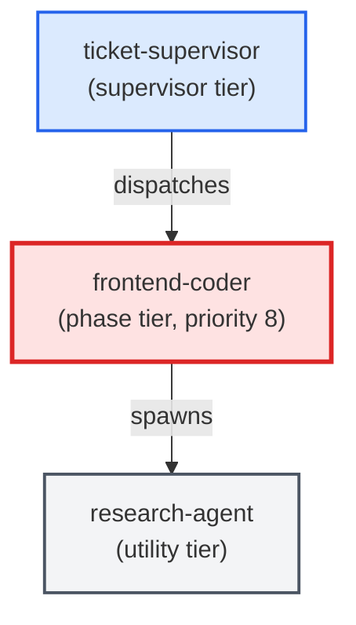

# frontend-coder

**Standards-enforcing frontend/UI implementation agent. Writes, edits, and
refactors HTML, CSS, JavaScript, TypeScript, React, Vue, Svelte, and other
web-layer files. Loads optional webapp-testing skill when installed. Embeds
design principles directly (does NOT load the legacy frontend-design skill
even if present). Delegates Python logic to python-coder and SQL changes to
sql-coder via Stop-and-Ask rules.

Use when: ticket involves creating or modifying frontend/UI components,
markup, or styles; ticket requires visual changes to a web interface;
files_touched contains .tsx, .jsx, .vue, .svelte, .html, .css, or .scss.

See ADR-005 for the sibling-agent design rationale.**

| Field | Value |
|-------|-------|
| Model | sonnet |
| Tier | phase |
| Priority | 8 |
| Portable | Yes |
| Sign-off capable | Yes |

---

## When to Use

### Spawned By

- `ticket-supervisor`
---

## Knowledge Flow

| Channel | Source | Injection Mode | Description |
|---------|--------|----------------|-------------|
| 1 | template description field | — | — |
| 3 | ticket_path from ticket-supervisor | — | — |
| 4 | pre-flight file reads | — | — |
| 5 | skills_config.json config_keys | — | — |
| 6 | project files read during execution | — | — |
| 7 | bash command output (git, build, tests) | — | — |
| 8 | PROJECT_CONTEXT.md | — | — |
---

## Spawn and Dependency

---

## Input / Output Contract

### Inputs

| Name | Type | Description |
|------|------|-------------|
| `ticket_path` | file_path | Absolute path to the ticket markdown file |

### Outputs

| Name | Type | Description |
|------|------|-------------|
| `sign_off_comment` | sign_off_comment | Sign-off comment with status: ok | blocker | handoff |

### Mutates (Side Effects)

| Name | Type | Description |
|------|------|-------------|
| `ticket_frontmatter_agents_status` | — | Sets agents.frontend-coder to signed_off or failed |
| `sign_offs_checklist` | — | Checks the frontend-coder checkbox with timestamp |
| `implementation_artifacts` | — | Files created or modified during phase execution |
---

## Tools Available

| Tool |
|------|
| `Bash` |
| `Read` |
| `Edit` |
| `Write` |
| `Agent` |
---

## Skills Used

| Skill | Mode | Condition |
|-------|------|-----------|
| `webapp-testing` | conditional | — |
| `signoff` | conditional | — |
---

## Configuration

| Key | Required | Description |
|-----|----------|-------------|
| `frontend.project_context_path` | No | Path to PROJECT_CONTEXT.md for the frontend-coder agent (default: .agents/agents/frontend-coder/PROJECT_CONTEXT.md) |
| `frontend.optional_skills` | No | List of installed optional skill names (e.g. [webapp-testing]). Note: frontend-design is no longer an optional skill — design principles are embedded in this template. |
| `frontend.test_command` | No | Command to run the frontend test suite after changes (e.g. npm test, yarn vitest) |
---

## Contributor Notes

### Key Behavioral Patterns

| Pattern | Trigger | Behavior | Related Agent |
|---------|---------|----------|---------------|
| Stop-and-Ask | condition requiring user decision or out-of-scope action | Halt immediately. | `None` |
| Delegation to research-agent | task requiring research-agent capabilities | Delegates to research-agent via Agent tool | `research-agent` |
| Delegation to python-coder | task requiring python-coder capabilities | Delegates to python-coder via Agent tool | `python-coder` |
| Delegation to sql-coder | task requiring sql-coder capabilities | Delegates to sql-coder via Agent tool | `sql-coder` |
| Conditional Behavior | installed:** After making UI changes | invoke the webapp-testing skill by | `None` |
| Conditional Behavior | a `Delivers to:` item is ambiguous | add a one-line comment in the code and | `None` |
---

## AC Assignments

### frontend-coder

- UXP-100d-2: Frontend-coder agent consumes the handoff artifact without human translation
