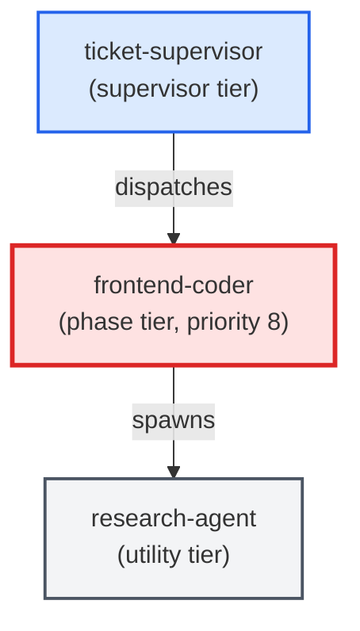

# frontend-coder

**Standards-enforcing frontend/UI implementation agent. Writes, edits, and
refactors HTML, CSS, JavaScript, TypeScript, React, Vue, Svelte, and other
web-layer files. Loads optional webapp-testing and frontend-design skills
when installed. Delegates Python logic to python-coder and SQL changes to
sql-coder via Stop-and-Ask rules.

Use when: ticket involves creating or modifying frontend/UI components,
markup, or styles; ticket requires visual changes to a web interface;
files_touched contains .tsx, .jsx, .vue, .svelte, .html, .css, or .scss.

See ADR-005 for the sibling-agent design rationale.**

| Field | Value |
|-------|-------|
| Model | sonnet |
| Tier | phase |
| Priority | 8 |
| Portable | Yes |
| Sign-off capable | Yes |

---

## When to Use

### Spawned By

- `ticket-supervisor`
---

## Knowledge Flow

*No knowledge channels declared.*

---

## Spawn and Dependency

---

## Input / Output Contract

*No structured I/O contract declared.*
---

## Tools Available

| Tool |
|------|
| `Bash` |
| `Read` |
| `Edit` |
| `Write` |
| `Agent` |
---

## Skills Used

| Skill | Mode | Condition |
|-------|------|-----------|
| `signoff` | — | — |
| `webapp-testing` | — | — |
| `frontend-design` | — | — |
---

## Configuration

| Key | Required | Description |
|-----|----------|-------------|
| `frontend.project_context_path` | No | Path to PROJECT_CONTEXT.md for the frontend-coder agent (default: .agents/agents/frontend-coder/PROJECT_CONTEXT.md) |
| `frontend.optional_skills` | No | List of installed optional skill names (e.g. [webapp-testing, frontend-design]) |
| `frontend.test_command` | No | Command to run the frontend test suite after changes (e.g. npm test, yarn vitest) |
---

## Contributor Notes

No conditional behaviors — this agent follows a single fixed execution path
