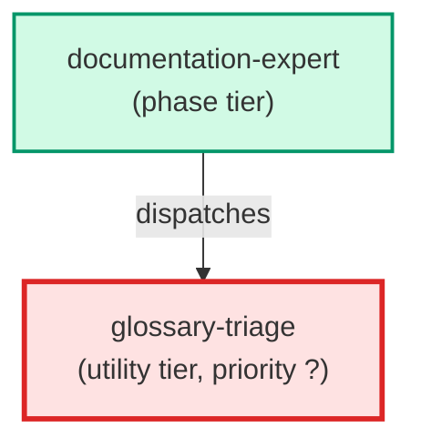

# glossary-triage

**Pinned-haiku agent that classifies a jargon candidate term and returns a structured JSON decision. Accepts a candidate term plus up to 5 context windows from glossary_detector.py and returns one of three actions: add_to_glossary, add_to_blacklist, or false_positive. Never modifies files — only returns decisions. Invoked by glossary-bootstrap, check_glossary_coverage pre-commit hook, and documentation-expert coverage-lint step.**

| Field | Value |
|-------|-------|
| Model | haiku |
| Tier | utility |
| Priority | — |
| Portable | Yes |
| Sign-off capable | No |

---

## When to Use

### Spawned By

- `documentation-expert`
---

## Knowledge Flow

*No knowledge channels declared.*

---

## Spawn and Dependency

---

## Input / Output Contract

*No structured I/O contract declared.*
---

## Tools Available

| Tool |
|------|
| `Bash` |
| `Read` |
---

## Skills Used

*No skills declared.*
---

## Configuration

*No configuration keys declared.*
---

## Contributor Notes

No conditional behaviors — this agent follows a single fixed execution path
