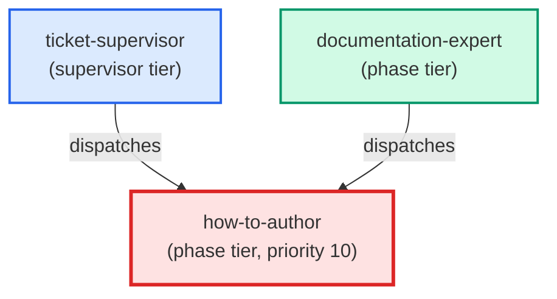

# how-to-author

**Writes a task-oriented how-to guide for this project following the canonical
convention in docs/how-to/documentation/write-how-to.md. Produces the guide
file, chooses the correct location per the codified decision rule, and returns
a structured payload naming the path and location rationale.
(internal — invoked by documentation-expert only)**

| Field | Value |
|-------|-------|
| Model | sonnet |
| Tier | phase |
| Priority | 10 |
| Portable | Yes |
| Sign-off capable | Yes |

---

## When to Use

### Spawned By

- `ticket-supervisor`
- `documentation-expert`
---

## Knowledge Flow

| Channel | Source | Injection Mode | Description |
|---------|--------|----------------|-------------|
| 1 | template description field | — | — |
| 3 | ticket_path from ticket-supervisor | — | — |
| 6 | project files read during execution | — | — |
| 7 | bash command output (git, build, tests) | — | — |
---

## Spawn and Dependency

---

## Input / Output Contract

### Inputs

| Name | Type | Description |
|------|------|-------------|
| `ticket_path` | file_path | Absolute path to the ticket markdown file |

### Outputs

| Name | Type | Description |
|------|------|-------------|
| `sign_off_comment` | sign_off_comment | Sign-off comment with status: ok | blocker | handoff |

### Mutates (Side Effects)

| Name | Type | Description |
|------|------|-------------|
| `ticket_frontmatter_agents_status` | — | Sets agents.how-to-author to signed_off or failed |
| `sign_offs_checklist` | — | Checks the how-to-author checkbox with timestamp |
| `implementation_artifacts` | — | Files created or modified during phase execution |
---

## Tools Available

| Tool |
|------|
| `Bash` |
| `Read` |
| `Edit` |
| `Write` |
| `Agent` |
---

## Skills Used

| Skill | Mode | Condition |
|-------|------|-----------|
| `signoff` | conditional | — |
---

## Configuration

*No configuration keys declared.*
---

## Contributor Notes

### Key Behavioral Patterns

| Pattern | Trigger | Behavior | Related Agent |
|---------|---------|----------|---------------|
| Stop-and-Ask | condition requiring user decision or out-of-scope action | Do not proceed without doing this. | `None` |
| Conditional Behavior | a ticket is provided (`ticket_path`) | check whether the ticket body contains | `None` |
| Conditional Behavior | writing the guide: add required sections | ensure required steps are covered, | `None` |
---

## AC Assignments

### how-to-author

- BO-3200c-4: A how-to shows a person how to answer a paused run and how to resume it
- TKT-500b-5: How-to: configuring and overriding TDD sequencing
- TKT-500c-5: How-to: reading and interpreting AC delivery state
