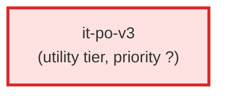

# it-po-v3

**IT Product Owner v3 — technical enrichment agent for the v3 ticket-creation
pipeline. Operates AFTER the BA v3 has produced L2/L3 AC YAML files. Enriches
each AC with technical fields: assigned_agent, it_requirements, estimated_complexity,
delivers_to/expects_from contracts, and doc_links to architecture documents.

Does NOT create tickets. Does NOT modify the BA's criteria field. Uses
architecture docs, component registries, and agent registries to understand
the technical landscape. Splits ACs when technical boundaries reveal
multi-agent work.

Use when: the BA v3 has produced L2/L3 AC files and the pipeline needs technical
enrichment before implementation agents can begin work.

This is NOT a replacement for it-po.md (the v2 IT PO that produces Agent Contracts
sections in ticket bodies). This agent operates on AC YAML files directly.**

| Field | Value |
|-------|-------|
| Model | opus |
| Tier | utility |
| Priority | — |
| Portable | Yes |
| Sign-off capable | No |

---

## When to Use
---

## Knowledge Flow

*No knowledge channels declared.*

---

## Spawn and Dependency

---

## Input / Output Contract

*No structured I/O contract declared.*
---

## Tools Available

| Tool |
|------|
| `Read` |
| `Write` |
| `Bash` |
| `Skill` |
---

## Skills Used

*No skills declared.*
---

## Configuration

*No configuration keys declared.*
---

## Contributor Notes

No conditional behaviors — this agent follows a single fixed execution path
