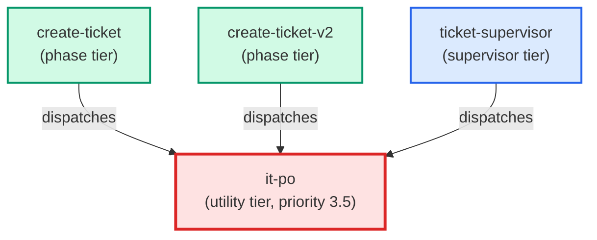

# it-po

**IT Product Owner (Opus-tier). Translates business ACs from the business-analyst
into per-agent technical contracts with explicit "Delivers to" / "Depends on"
blocks. Reads architecture-level documentation only — never raw source files.
Requires at least one clarifying question before producing contracts.
Activates only when >1 coder agent is needed; falls through to refinement otherwise.
Handles oversized-ticket splits via §7 Split Protocol when check_ac_limits fires.
Use when: create-ticket routes a multi-coder ticket to the IT PO phase.**

| Field | Value |
|-------|-------|
| Model | opus |
| Tier | utility |
| Priority | 3.5 |
| Portable | Yes |
| Sign-off capable | Yes |

---

## When to Use

### Spawned By

- `create-ticket`
- `create-ticket-v2`
- `ticket-supervisor`
---

## Knowledge Flow

*No knowledge channels declared.*

---

## Spawn and Dependency

---

## Input / Output Contract

*No structured I/O contract declared.*
---

## Tools Available

| Tool |
|------|
| `Bash` |
| `Read` |
---

## Skills Used

| Skill | Mode | Condition |
|-------|------|-----------|
| `signoff` | — | — |
---

## Configuration

*No configuration keys declared.*
---

## Contributor Notes

No conditional behaviors — this agent follows a single fixed execution path
